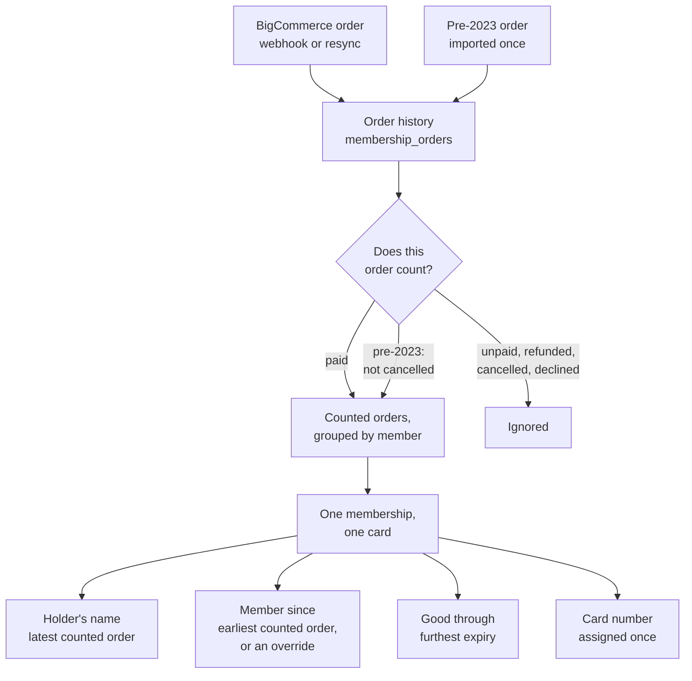
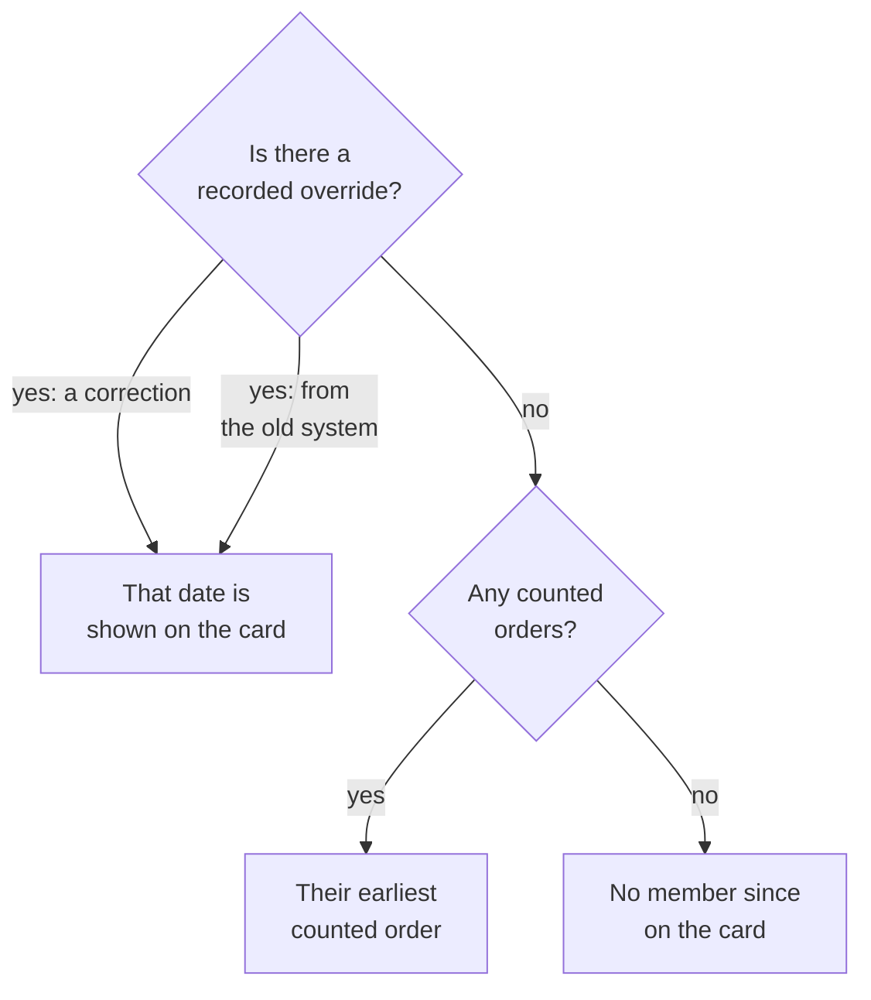

# Where Membership Card Information Comes From

This document is written for the Merch Team, who administer the storefront and
answer the questions that arrive at `merchteam@losverdesatx.org`. It explains,
in plain language, where every piece of information printed on a Los Verdes
membership card comes from, and exactly how the software decides whether
someone counts as a current member today. When a member writes in to say their
card is wrong, this is the document that says which of these rules produced
what they are looking at.

The Membership Committee (`mc@losverdesatx.org`) is consulted on all of it.
These rules describe how membership works, which is their remit whoever
administers it day to day, and a change to any of them is worth their input. A
smaller number of decisions are theirs outright -- anything that settles a
person's standing in the group, such as whether a membership is revoked
before it expires or somebody is expelled. Those are marked where they appear,
and that address is who to hand one to.

This is a description of what the code does right now. It documents the
current implementation explicitly, for reference, _and also_ to invite
feedback and proposals to change that implementation. Code and database names
appear in `backticks` after each plain-English statement, for anyone who wants
to check a claim against the source.

Because it is how the group's stakeholders see the way membership works, this
document is the specification the rest of the repository follows. Where it and
the code disagree, that is a defect rather than a documentation lag, and every
other document here is written to agree with this one.

The last section, [Decisions worth confirming](#9-decisions-worth-confirming),
gathers the places where the software had to pick a rule and where a different
policy would be equally easy to implement. That is the most useful section to
take to the Membership Committee, though feedback on any part of this is
welcome.

## 1. The short version

* Orders are the only raw material. Every card is rebuilt from a person's
  order history; the card itself stores no independent state.
* Only orders containing a membership product are recorded at all. Merch
  never reaches this system, and BigCommerce remains the authoritative record
  of what was bought ([section 3](#3-what-an-order-is-and-where-it-comes-from)).
* Not every order counts. A BigCommerce order counts only once it is paid.
* Orders from before February 2023, when Los Verdes moved to BigCommerce, are
  described in [the appendix](#appendix-orders-from-before-bigcommerce).
* All of one person's counted orders collapse into a single membership and a
  single card. The card's "good through" date is the furthest expiry among
  them; "member since" is the earliest order, unless a recorded override says
  otherwise.
* A person is identified by email address. An order can be pointed at somebody
  other than the person who paid, which is how gift purchases work.

## 2. How it fits together

The rebuild happens in one place (`refreshMemberFromOrders()` in
`src/bigcommerce/sync.ts`). It runs whenever an order arrives or changes, when
the scheduled resync revisits an order, and when an order is re-attributed by
hand. Each run recomputes the whole membership from the whole history rather
than nudging the previous answer, which is why a refund or a correction takes
effect on its own, and why the result does not depend on the order in which
orders happen to arrive.

The diagram keeps its labels short so they render legibly; the exact statuses
behind "does this order count" are in
[section 5](#5-how-the-software-decides-who-is-a-current-member), and what an
order is in the first place is the next section.

## 3. What an order is, and where it comes from

Everything on a card is derived from orders, so it matters exactly what counts
as one, and how far our list of them can be trusted to match the storefront's.

### What makes an order a membership order

An order becomes a membership order when one of the products on it is a
membership. The SKU is what decides: the software holds an explicit list of
membership SKUs (`MEMBERSHIP_SKUS` in `src/bigcommerce/sync.ts`, currently the
single entry `LOSV-MEM-0001`), and an order is recorded here only when one of
its line items matches. Everything else the
storefront sells passes by untouched: an order for a scarf creates no record,
and an order containing both a scarf and a membership is recorded as the
membership it contains.

### One order, one membership

This software depends on an arrangement it does not control and does not
enforce: **a single order never carries more than one membership.** That is
maintained in the storefront's own configuration, which is the Merch Team's
side of the boundary rather than this software's.

The dependency is not a detail of one function. Order history is keyed on the
order's own id (`membership_orders.order_id` is the primary key), so an order
has exactly one row and one membership to give. Attribution works at the same
grain: re-pointing a gift moves the whole order to the recipient
([section 8](#8-gift-purchases-and-re-attributed-orders)), because an order is
the smallest thing that can be pointed at anybody.

There are two ways an order can carry a second membership: two membership
line items, or one line item with a quantity above one. Either way exactly one
membership is recorded, attributed to whoever paid, and the second produces no
card. Somebody has paid for a membership that does not exist, which is the
case the report below exists for.

**So two memberships mean two orders.** A member buying one for someone else
as well as renewing their own should place separate orders, and the gift order
is then re-attributed to the recipient.

That is a constraint of how orders are stored rather than a law of nature.
Giving every membership line item its own row would lift it, and was
considered and set aside as not worth the added complexity
([#198](https://github.com/los-verdes/card-losverd-es/issues/198)); the
reasoning is there if the question comes back.

**This is checked.** Each time an order is read from the store, the
memberships on it are counted across every line item, quantities included, and
the number is recorded against the order
(`membership_orders.membership_units`). An order carrying more than one is
listed on the admin reports under "More than one membership", and the first
time one is seen it is announced in Slack.

What the check deliberately does not do is change who is a member. The order
still confers the one membership it is recorded as, exactly as it did before —
the same choice made for orders the store stops returning. Revoking
somebody's membership is a decision a person makes, and a line item is not a
good enough reason to make it automatically. What the report says is the
opposite: somebody has paid and is owed something, which is a thing to put
right rather than a thing to take away.

The count is taken fresh on every sync, so an order corrected in BigCommerce —
the extra refunded, or the quantity put back to one — drops off the report by
itself. Orders loaded by the one-time legacy import carry no count at all,
because the export has no line-item detail to count; that is recorded as
unknown rather than as one.

One consequence is worth stating plainly: **a membership sold under a SKU that
is not on that list is invisible to this software.** It produces no card and
appears in no report. Adding a new membership product to the storefront
therefore means adding its SKU here too, which is a code change rather than a
store setting, and is the first thing to check if a new product's buyers say
they never received a card.

### BigCommerce is the record; this is a copy

**The storefront is authoritative.** Nothing in this software creates an
order, and no screen in it can add one by hand. Every BigCommerce order here
was read from the store, is keyed by the store's own order id
(`membership_orders.order_id`) -- the same number the Merch Team sees in the
store's admin and a member sees on their receipt -- and is refreshed from the
store whenever it is read again.

The exception is the orders from before February 2023, which were loaded once
from the old system's database and have no storefront left to be re-read from.
Everything in this section applies to BigCommerce orders; the imported ones
cannot be repaired by reading them again, which is one reason they are
described separately in
[the appendix](#appendix-orders-from-before-bigcommerce).

There is exactly one piece of order information this system holds that the
storefront does not: who the membership is attributed to
(`membership_orders.member_email`), which is what makes gifts and corrected
addresses possible — see
[section 8](#8-gift-purchases-and-re-attributed-orders). That field is
deliberately never overwritten by a re-read. Every other field is the store's.

A copy arrives by two routes, which run the same code:

* **The store tells us.** A webhook fires when an order is placed or changes,
  and the order is fetched and recorded within seconds
  (`POST /bigcommerce/order-webhook`).
* **We re-read the store.** A scheduled resync walks the store's order list
  and re-reads everything modified recently, whether or not a webhook for it
  ever arrived (`sync_subscriptions_etl`).

### Why the copy can be trusted

These are properties of how the copy is kept, not a promise that nothing goes
wrong. What they buy is that mistakes are correctable and do not accumulate:

* **Re-reading an order is always safe.** Recording an order overwrites any
  existing row for that order id rather than adding a second one, so the same
  order can be processed any number of times with an identical result. That is
  what makes repair cheap: the fix for anything that looks wrong is to read it
  again.
* **Every field is replaced from the store, never merged.** A correction made
  in BigCommerce — an amended name, a fixed email, a changed status —
  overwrites what we hold the next time that order is read. The copy cannot
  drift by accumulating edits, because it never edits; it overwrites.
* **The resync overlaps on purpose.** It re-reads a trailing window rather
  than resuming exactly where it left off, so an order modified right at the
  edge of the previous run's window is read twice rather than missed once.
* **It walks by order id, not by page number.** Page numbers shift underneath
  a long run as orders change; an id cursor does not, so a run cannot skip
  orders because the store re-sorted them mid-walk.
* **Re-reading the whole store is a normal operation**, not an emergency
  measure, and it is the intended answer to "are we certain this is right?".
* **An order that disappears is flagged, not dropped.** If BigCommerce stops
  returning an order we hold, it is marked and listed on the "Missing from
  BigCommerce" report rather than deleted, and the member's card is left
  alone. If the order reappears, the flag clears itself.
  Revoking memberships on the strength of one unanswered request would
  turn a storefront incident into members losing their cards en masse.

### What this does not catch

* **Archived orders.** Deleting an order in BigCommerce archives it: the
  order is still there, marked as deleted, and this system keeps syncing it
  as if it were not. An archived order therefore keeps counting towards its
  member's membership, and nothing flags it. Whether it should -- or
  whether archiving should work like a refund -- is worth confirming with
  the Merch Team, who are the ones who would archive an order.
* **Memberships sold under an unlisted SKU**, as above.
* **Renewals taken through MiniBC.** MiniBC handles recurring subscriptions,
  and those do not flow through order webhooks at all. Reconciling them is
  not built yet and is not planned before the migration finishes, so a MiniBC
  renewal reaches this system only if it also produces a BigCommerce order.

None of these can invent a membership that was never bought; each of them can
leave this system holding a stale answer. If a member's record looks wrong and
the reason is not somewhere in this document, re-reading their orders from the
store is the first thing to try, and it cannot make matters worse.

## 4. Each field on the card

Every card format — the Apple Wallet pass, the "Save to Google Wallet" card,
the emailed card image, and the QR verification page — reads the stored
membership record (`members`) through one shared lookup (`MEMBER_SELECT` in
`src/member/artifacts.ts`), which layers the corrections described below on
top of it. So the formats cannot disagree with each other.

### Holder's name

Whatever the member has asked to be shown, and otherwise the billing name on
their **most recent counted order** (`deriveMembershipState()` in
`src/bigcommerce/sync.ts`, taking `first_name` and `last_name` from the latest
order by date). It is shown as first and last
name joined with a space — the large field on the front of the pass
(`buildPassJson()` in `src/passkit/generator.ts`) and the card image
(`src/cardimage/template.ts`).

If that order carries no name — which happens for some imported historical
rows — the name already on file is kept, and for a
brand-new record the name from the order currently being processed is used
instead.

Two consequences worth noting. The name follows the store: a member who
updates their billing name at checkout sees the card follow on their next
purchase, and a member who never buys again keeps the name from their last
purchase indefinitely. And because an attributed gift order still carries the
*purchaser's* billing name, a gifted card can end up showing the giver's name
(see [section 8](#8-gift-purchases-and-re-attributed-orders)).

**A member can set the name on their own card**, signed in, and what they put
there is shown instead of the name their orders give
(`member_display_names`). It is one free-text field rather than a first and
last name, which suits a mononym or a name that does not split in two.
Clearing it puts the card back to the derived name, which stays intact
underneath, so nothing is lost by trying something.

**An admin can set one too**, from the member page in the admin area. It
matters most for a gifted membership: attribution moves the membership to the
person it was bought for, but the card keeps the buyer's billing name until
the recipient orders something of their own.

A name can therefore arrive three ways — the member, an admin, or the one-time
import carrying across one chosen on the previous site — and the admin page
says which, alongside the name the orders give. Where a person did it, it
also says **who**, by the address they signed in with. That is the answer to
"why does my card say this", and to "who decided that" if the first answer is
not enough.

Beyond a length limit (`MAX_DISPLAY_NAME_LENGTH`, 64 characters, so it fits
on a card), nothing checks what goes in that field. A membership card is a fun vanity
item rather than an identity document and gets very little scrutiny in
practice, so a card showing a nickname, or a name that is nobody's real one,
is working as intended. If the group would rather that were not so, this is
a good thing to say so about -- see
[question 6](#9-decisions-worth-confirming).

### There is no membership type, and the card shows none

Los Verdes sells one membership and draws no distinction between kinds of
member, so a card carries a name, a "member since", a "good through" and a
card number, and nothing that sorts its holder into a category. The previous
site's cards were the same three things plus the card number on the back.

If the store ever does sell a second membership product, a type can be worked
out from the orders: `membership_orders.sku` records what each person bought.
Which SKUs count as a membership at all is a separate list, `MEMBERSHIP_SKUS`
([section 3](#3-what-an-order-is-and-where-it-comes-from)).

Card themes are a separate matter and deliberately not built on this. A type
derived from an order is recomputed on every sync, so a theme stored that way
would be overwritten each time its holder renewed. A theme is a choice
somebody makes, so it belongs in its own table keyed on their address, the way
a chosen display name already works
([section 4](#4-each-field-on-the-card)).

### Member since

The earliest date the group has on record for this person, shown as month and
year only (for example "Jul 2021", via `formatMonthYear()` in
`src/lib/dateFormat.ts`). Two sources can supply it and they do not agree in
every case, so the precedence matters — [section 6](#6-member-since-and-its-precedence-chain)
covers it in full.

When neither source has a date, the field is left off the card entirely rather
than shown blank.

### Good through (the expiry date)

The furthest expiry among all of the person's counted orders, shown as a full
date (for example "Feb 17, 2024", via `formatShortDate()`).

Each order carries its own expiry, fixed when the order is recorded: exactly
365 days after the order was placed (`membershipExpiry()` in
`src/bigcommerce/orders.ts`, `MEMBERSHIP_DURATION_DAYS = 365`, stored as
`membership_orders.expires_on`), which is carried over deliberately from the
behaviour of the previous membership site
([`digital-membership`](https://github.com/los-verdes/digital-membership)).
"The old system" below always means that application and the Postgres database
behind it.

The card's date is then the latest of those per-order expiries. Nothing is
added up and nothing is stitched together: a second order does not extend the
first one's year, it simply contributes its own expiry to the comparison. This
is the mechanism behind renewals, and also the reason an early renewal can
lose a few days — see [section 7](#7-several-orders-one-membership-one-card).

If no order counts — every one refunded, say — the expiry is emptied and the
membership is no longer current.

### Card number and QR code

The card number (`Card #` on the back of the Apple pass, and the small line
under the QR code on the card image) is the membership record's own identifier
(`members.member_id`), a value of the form `LV-` followed by a random unique
string, for example `LV-6f1c8e40-0000-4000-8000-a1b2c3d4e5f6`. It is assigned
once, when the membership record is first created, and never changes
afterwards — not on renewal, not on a name change, not on a resync. It is also
the serial number baked into every Wallet pass issued for that person, which
is why it has to stay stable.

Deliberately, it is **not** derived from the store's customer number. Two
reasons, both from real data: every guest checkout shares customer number `0`,
and a gifted order carries the *buyer's* customer number, not the recipient's.
Neither identifies a member. Records are always found by email address, so the
card number never needs to be reproducible from anything else.

The QR code encodes a signed verification link for that card number. Scanning
it (and signing in) shows the holder's name and whether their membership is
current *right now* — computed live, not read off the card
(`src/member/verify-pass.tsx`, `lookupPassHolder()` in
`src/member/passHolder.ts`). Cards issued by the old system and still in
circulation resolve the same way: the old card's serial is looked up
(`legacy_membership_cards`) to find the holder, and then the holder's current
membership is shown, not the dates printed on that old card. If that holder
has no current membership record at all, the old card's own dates are shown as
a last resort.

### What differs between card formats

| | Apple Wallet pass | Google Wallet card | Emailed card image |
| :--- | :--- | :--- | :--- |
| Holder's name | yes | yes | yes |
| Member since | yes | yes | yes |
| Good through | yes | yes | yes |
| Card number | on the back | as QR alt text | under the QR code |
| Status note | on the back, only when not active | pass state (active / expired / inactive) | not shown |

All three carry the same fields.

## 5. How the software decides who is a current member

Two separate questions are involved, and they are answered in different
places.

**Does an individual order count as a membership?** This is
`COUNTS_AS_MEMBERSHIP` in `src/lib/membershipOrders.ts`. It is a single shared
rule used by the card rebuild, by the admin reports
(`src/admin/reportQueries.ts`), and by the order-attribution screens
(`src/admin/attribution.ts`), specifically so a card and a report can never
disagree about the same order.

**Is the person a current member today?** Their membership is current if the
card's expiry date is today or later and the record has not been revoked
(`isMembershipCurrent()` in `src/member/artifacts.ts`). Every gate that
matters — access to the member portal, emailing a card, the QR verification
page — checks the expiry date directly rather than trusting a stored
active/expired label, because that label is only recalculated when an order
sync happens to touch the record.

**A membership can also be revoked, or the person expelled from the group**,
which are the two ways of ceasing to be a current member that have nothing to
do with orders. Both words are taken from the [code of
conduct](https://www.losverdesatx.org/code-of-conduct): it gives the
Membership Committee the power to "revoke or temporarily suspend that person's
membership", and names expulsion from Los Verdes as the heaviest outcome of
its sanction process. The software records an outcome; the code of conduct
governs when one is appropriate, and how it is appealed.

Expulsion is the heavier of the two, and the rarer. As well as taking the
membership away it stops the person signing in at all, including on a session
they already hold, and it carries no end date -- lifting it is a decision
somebody makes rather than something that happens on its own (`banned_people`,
a table named before this wording settled). A revocation is about a card; an
expulsion is about a person, and so follows their address onto any membership
they buy under it later.

**A temporary suspension has no form of its own here.** The code of conduct
allows the Committee to suspend a membership as well as revoke it, and the
software has only the one action, lifted by hand when the Committee decides it
should be. That is a gap worth naming rather than a position the software
takes -- see [question 8](#9-decisions-worth-confirming).

Revocation, in more detail: it is recorded against the card (`revoked_cards`)
rather than on the membership record, because the order sync rebuilds that
record and would undo it. While it is in force the card reads as revoked,
carries no expiry, and its holder is refused everywhere a current membership
is required.

There is also a stored label, `members.status`, and **nothing reads it.**
Whether a card is good is answered from the expiry date and from those two
tables, never from that column; the "Expired" note on the back of an Apple
pass and the state Google Wallet is told are both worked out at the moment a
pass is built (`effectiveStatus()` in `src/member/artifacts.ts`). The order
sync still writes the column, so it is on its way out rather than gone
([#224](https://github.com/los-verdes/card-losverd-es/issues/224)); a stored
value that looks authoritative and is not is how somebody later comes to
trust it.

One real limit sits underneath all of this: a pass already on a phone is not
rebuilt merely because a date passed. It is corrected the next time it is
rebuilt — a renewal, an attribution, a re-download — so an installed pass can
go on saying "active" for a while after the membership lapsed, even though
every access check already refuses it.

### Which orders count

**A BigCommerce order counts only when it is paid.** The statuses that count
are `Awaiting Fulfillment`, `Awaiting Shipment`, `Partially Shipped`,
`Shipped` and `Completed` (`PAID_BIGCOMMERCE_STATUSES`). Everything else is
excluded, and the exclusions fall into two groups: not yet paid (`Incomplete`,
`Pending`, `Awaiting Payment`) and money returned or the sale undone
(`Refunded`, `Partially Refunded`, `Cancelled`, `Declined`, `Disputed`, and
any other status the store may report). The list is an allow-list, so an
unfamiliar BigCommerce status does not confer membership. `Partially
Refunded` sits in the second group on purpose: the status cannot say which
part of the order was refunded, and the rule does not confer membership on a
refund it cannot read.

That last property is worth watching rather than trusting, because its cost
falls on a member rather than on us. Checking the list against every status
the old system ever recorded turned up `Partially Shipped` on four orders —
paid, with part of it already sent — which the list was missing. A status
nobody has thought of is the shape this failure takes.

That is the rule for every order placed since February 2023, and so for every
current membership. Orders from before then are scored differently, for
reasons set out in [the appendix](#appendix-orders-from-before-bigcommerce).

## 6. "Member since" and its precedence chain

"Member since" is the one field on the card with more than one possible
source, because the group's early history does not exist in the current store.

**The order-derived value.** Each time a membership is rebuilt, the earliest
counted order's date is stored on the record (`members.member_since`). This
includes the imported historical orders, so once that one-time import had
loaded, this value alone is often already correct.

**The override, which wins.** A separate table
(`member_since_overrides`) holds authoritative dates that did
not come from current orders. When a card is rendered, the override is used if
one exists, and the order-derived value is used only if none does — a plain
"prefer the override" choice, visible as the `COALESCE` in the shared
membership lookup in `src/member/artifacts.ts`. Every card format goes through
that lookup, so the override applies everywhere consistently.

Overrides come from two places, recorded in the row's `source`:

* **The old system's records** (`legacy_postgres`). A one-time export of the
  old application's own "member since" value, which it computed as the
  earliest membership order it had for that person. For early members this is
  the only surviving record of when they joined, and it is loaded by the
  scripts under `scripts/legacy-export/`.
* **Manual corrections** (`manual`). Set on the **Member since** admin page,
  which shows the date a member's orders imply alongside any correction
  already recorded, and takes a note saying why. Clearing a correction only
  removes a manual one, so a date that came from the old system cannot be
  deleted by accident. No database access or developer needed.

A manual correction outranks the imported value: re-running the legacy import
updates only rows that came from the import itself and leaves a manual row
alone (`buildImportStatements()` in `src/legacy/import-sql.ts`). There is at
most one override per email address, so the two sources never coexist for one
person — the manual row simply survives.

**On trustworthiness.** These sources are not equally reliable, and the
current rule does not rank them by reliability, only by origin:

* The order-derived date is the most auditable — it points at a specific
  order that counts today.
* The imported date was computed over *every* historical membership row for
  that person, without excluding cancelled or test orders. It can therefore be
  slightly earlier than the order history would justify.
* A manual date is as good as the judgement behind it, and is the right tool
  when a member's history genuinely predates the records.

A correction records who made it, shown alongside the date and the note. The
date the group has been told somebody joined is the sort of thing a person is
asked about later, and a note nobody can attribute answers half the question.

Because the rule is "prefer the override", an override wins even when it is
*later* than the earliest counted order, which is not what "member since"
usually implies. See the questions in [section 9](#9-decisions-worth-confirming).

Changing an override immediately marks that member's card as stale, so the
next time their pass is fetched it is regenerated with the new date. That is
enforced by the database itself (triggers on that table), so it works
even when a date is corrected with hand-written SQL. Already-installed Wallet
passes pick the change up on their next routine update rather than being
pushed immediately.

## 7. Several orders, one membership, one card

One person's whole order history collapses into one membership record and one
card. The mechanics live in `refreshMemberFromOrders()` in
`src/bigcommerce/sync.ts`:

1. Every order attributed to that email address that counts as a membership
   is read.
2. Those orders are reduced to one set of card values
   (`deriveMembershipState()`): earliest order for "member since", furthest
   expiry for "good through", latest order for the name.
3. The existing membership record for that email address is updated in place,
   or a new one is created if there is none.

Three properties of this design are deliberate.

**An order is a separate thing from a membership.** Orders are history, kept
one row per order forever. A membership is a current summary, rebuilt on
demand. That separation is what lets a correction of any kind — a refund, a
re-attribution, a newly imported historical order — take effect simply by
recomputing, with no repair work and no risk of a stale card. It is also why
the card number is a random `LV-<unique id>` rather than anything derived from
a store customer number: a membership is not an order and does not inherit an
order's identifiers.

**Renewals extend by comparison, not by accumulation.** With two counted
orders, the card's expiry is the later of the two per-order expiries. A member
who renews after their previous year has ended gets a fresh year from the
purchase date. A member who renews a month early gets 365 days from the
purchase date, which is *not* the old expiry plus a year — the unused month is
not carried over. Buying two memberships at once does not produce two years
either; both orders expire on the same day, so the card shows one year.

**A lapsed member keeps their identity.** If every one of a person's orders
stops counting, their membership record is kept — and with it their card
number, their Wallet pass credentials, and their registered devices — with an
empty expiry, so the card is simply no longer current. Should they buy again,
the same card number comes back to life. Nothing is created for an address
with no counted orders and no existing record.

Alongside this, an update never touches a member's Wallet pass credentials or
their original creation date, and the "last updated" timestamp moves only when
something actually visible on the card changed. That last detail is what stops
a routine resync from making every member's phone re-download an identical
pass.

## 8. Gift purchases and re-attributed orders

Every order in the history records two email addresses:

* `order_email` — the address on the order itself, that is, the person who
  paid. Never changed.
* `member_email` — the address Los Verdes considers the member for that order.

Memberships are grouped by `member_email`, so that column alone decides which
card an order feeds. Normally the two are the same. They differ in two
situations: a **gift**, where one person buys a membership for another, and a
**changed address**, where a member's old order carries an email they no
longer use.

Re-pointing an order is an administrative action (`attributeOrder()` in
`src/admin/attribution.ts`). It does four things: updates the order's
`member_email`; appends a permanent audit record of the change — old address,
new address, which admin made it, an optional note, and when
(`membership_order_attributions`); rebuilds **both** people's
cards, since one loses that order's contribution and the other gains it; and
pushes a pass update to any device holding a card that changed.

For example, if order `1001`, placed by `buyer@example.com`, is attributed
to `recipient@example.com`, that year's
expiry moves off the buyer's card and onto the recipient's, and the recipient
gets a membership record — and a new card — if they did not already have one.
If the buyer has other counted orders, their own card simply falls back to the
furthest expiry among those.

Two safeguards keep an attribution from being quietly undone. The routine
BigCommerce sync refreshes everything the store reports about an order but
deliberately never rewrites `member_email` (`recordMembershipOrder()` in
`src/bigcommerce/orders.ts`), so a resync cannot hand a gift back to its
buyer. And the one-time legacy import skips an order that has an attribution
recorded against it, so an admin's decision outranks the historical export
(`src/legacy/import-sql.ts`).

What attribution does *not* change is the name on the order. The billing name
stays the purchaser's, and since the card's holder name comes from the latest
counted order, a gift can leave the purchaser's name on the recipient's card.
This is listed as a question below.

## 9. Decisions worth confirming

Each of these is a point where the software had to choose a rule and where a
different policy would be straightforward to implement. The current
behaviour is stated alongside each question, so the answer is a confirmation
or a change, not an open-ended design exercise.

1. **Should a paid-but-unshipped order confer membership immediately, or only
   once the order ships?** Currently membership starts as soon as the store
   marks an order paid — `Awaiting Fulfillment` and `Awaiting Shipment` both
   count — and the membership year is measured from the date the order was
   placed, not the date anything shipped. (A related wrinkle: the automatic
   card-delivery email is only sent once an order reaches `Completed`,
   so a member can be current for a while before the software emails them
   their card.)

2. **Should a refund or cancellation retroactively remove a membership?**
   Currently yes, and immediately: the order stops counting, so the card's
   expiry moves earlier or disappears, and the card stops verifying as
   current. If instead a refunded season should still count as membership for
   the year — for example a partial refund on a gift — that is a change to the
   counting rule.

3. **When someone renews early, should the new year extend from the old expiry
   or from the purchase date?** Currently from the purchase date. Renewing a
   month before expiry means that month is lost rather than added on.

4. **Should "member since" mean continuous membership, or the first time
   somebody ever joined?** Currently it means the first time ever. A member
   who joined in 2015, lapsed for five years, and rejoined last season carries
   a 2015 "member since" on their card, with nothing indicating the gap.

5. **When the historical records and the order history disagree about "member
   since", which should the card believe?** Currently the recorded override
   always wins, even when it is later than the earliest order that counts, and
   the imported historical dates were computed without excluding cancelled or
   test orders. An alternative worth considering is showing whichever date is
   earlier.

6. **Is a free-text name on a card the right latitude?** A member can set
   whatever they like as the name on their own card, and beyond a length
   limit nothing checks it.
   That follows from treating a card as a fun vanity item rather than an
   identity document -- one that gets very little scrutiny in practice, and
   where a nickname or a name that is nobody's real one costs nothing.

   The **Membership Committee** may see it differently, since a card is
   shown to other people, and they are the ones who would field it if a name
   somebody chose caused a problem. Worth their look rather than left to
   whoever wrote the page. If they want limits, the shapes available are an
   admin who can reset a name, a length or character restriction, or review
   before a name appears -- and the field is small enough that any of them is
   a modest change.

   The membership behind the card is a separate matter, guarded much more
   carefully: who counts as current, whether one can be revoked, who gets
   emailed. Between a member and an admin, whoever writes last wins and the
   record keeps which; nobody has needed to overrule anybody yet, so that is
   a simple rule rather than a considered one.

7. **Is an email address the right definition of a person?** Currently it is:
   one address, one membership, one card. A member who changes address is two
   people to the software until their old orders are re-attributed, and a
   recorded "member since" override follows the old address rather than the
   person.

8. **Are revocation and expulsion shaped the way the group wants them?**
   Both exist now. An admin revokes a membership from that member's page and
   the card stops working: it reads as revoked rather than expired, the "good
   through" date goes away, the passes already installed are told, and the
   holder loses the member area. A short note is kept alongside it, because
   somebody will be asked to explain the decision later. Lifting it is one
   action and puts the membership back to whatever the orders say, since
   nothing underneath was altered. Everything currently revoked sits on one
   page, deliberately short.

   Lifting one does not erase it. The record of a decision and its reversal
   is kept separately and permanently -- see [the history
   below](#what-is-kept-about-what-people-did) -- because the question "who
   decided this, and why" is asked most often about a decision that has since
   been undone.

   Two choices inside that are worth a look rather than assumed.

   **It follows the card, not the address.** A revocation is keyed on the
   card number, which never changes, so re-pointing an address does not lift
   it. But somebody who bought a fresh membership under a different address
   would get a new card, and this would not follow them to it. Whether that
   is a loophole or the right answer -- a new purchase being a genuinely new
   membership -- is a question about what revocation means rather than about
   the software.

   **It does not change what was sold.** They stop being listed as a current
   member, but the order stays in the monthly sales figures and in the
   consolidations. That is deliberate: the money is still the group's, and
   the books should not move because somebody was asked to leave. If a
   revocation should erase the sale too, that is a different thing and would
   need saying.

   What it is *for* remains the **Membership Committee's** to settle, as the
   code of conduct already says it is. The software makes no judgement about
   when this is appropriate and nothing in it is limited to conduct cases;
   the note is the only record of why, and it is free text.

   **Expelling somebody from the group** is the heavier version of the same
   thing, and is theirs outright. It takes the membership away exactly as a
   revocation does, and also stops the person signing in -- immediately,
   including on a session they already hold. It is recorded with no end date.
   In practice these are understood to run a couple of years, and that
   deliberately is not written into the software: an expulsion that lapsed on
   its own would let somebody back in without anybody deciding they should
   be, which is not a decision to automate. Lifting one is a single action
   and restores whatever membership it was suppressing.

   The limit worth knowing, because it is real rather than an oversight: an
   expulsion follows an **email address**. It covers a membership bought
   under that address later, and it does not follow somebody to a different
   one. Closing that would mean identifying people by something more than an
   address, which this system deliberately does not do
   ([question 7](#9-decisions-worth-confirming)).

   **Two things the code of conduct describes that the software has no form
   of.** The first is temporary suspension, which it names alongside
   revocation; here there is one action, and it stays until somebody lifts
   it. The second is the sanction ladder itself -- a verbal warning, then a
   formal one, then direct disciplinary action. Only the last rung leaves a
   mark here, so this is not a record of anybody's standing under that
   process and should not be read as one. Whether either belongs in the
   software, or is better kept wherever the Committee keeps its own notes, is
   a question for them. The same goes for an appeal: the code of conduct
   provides for one, and lifting a revocation or an expulsion here is the
   same single action whatever prompted it.

9. **Should an archived order still count?** Currently yes: deleting an order
   in BigCommerce archives it rather than removing it, and an archived order
   keeps counting towards its member's membership, with nothing flagged for
   anybody to look at. The alternatives are to treat archiving like a refund
   (it stops counting) or to keep counting but list archived orders for the
   Merch Team to decide about, as orders that disappear are listed today. It
   turns on what the Merch Team means when they archive an order -- tidying
   the order list, or undoing a sale.

## What is kept about what people did

Alongside the records of what is true now, there is a permanent record of what
was done: every revocation and expulsion and the lifting of either, every card
name set or cleared, every "member since" correction, every re-attributed
order, and every card email sent. Each line says when, what, who it was about,
who did it, and one sentence of detail -- including the value that was
replaced, where there was one. An admin can read it for one person or as a
recent-activity list (`/admin/audit`).

**Nothing is ever removed from it**, and that is the whole point. The tables
holding the current state answer "what is true now" by keeping only the
latest answer: lifting an expulsion deletes the row, clearing a chosen name
deletes the row, a new "member since" overwrites the old one. The reason
somebody gave, and the person who decided, go with them. But the questions
this record exists for -- "why does their card say that", "who decided this"
-- are asked about things that are no longer true at least as often as things
that are, and most often precisely when a decision is being appealed.

Two things it deliberately does not do. It does not record what the software
did on its own: an order syncing, an import running, a pass being rebuilt are
all routine, and a log that included them would bury the handful of entries
that represent a decision somebody made. And it does not record a card email
as a decision -- nobody chose to send it, a member asked or an order completed
-- but it does record that one went out, because "has anything been sent to
this person, and when" has no other answer.

## Appendix: orders from before BigCommerce

Los Verdes sold memberships through Squarespace until **February 2023**, which
is the last month with Squarespace orders and the first with BigCommerce ones.
An order's date is therefore enough to know which set of rules applies to it,
and each imported record also says which store it came from outright
(`membership_orders.source`, taken from the old system's own channel rather
than inferred from the shape of an order id).
Those older orders were recovered once, directly from the Postgres database
behind the previous site
([`digital-membership`](https://github.com/los-verdes/digital-membership)),
and imported into the same `membership_orders` table the current store's
orders land in (`scripts/legacy-export/`, `src/legacy/import-sql.ts`).

**They cannot make anyone a current member.** Every one of them expired years
ago, so nothing in this appendix affects who holds a valid card today. They
are kept because they are the only surviving record of when long-standing
members joined, and because cards issued in that era are still in wallets and
still have QR codes people scan. Squarespace itself is no longer accessible,
so these rows will never change again.

That is why they are here rather than woven through the document: for every
question about a current membership, the rules above are the whole answer.

### They count unless they were cancelled

The statuses that void one of these orders are `canceled`, `cancelled`,
`refunded` and `declined` (`VOID_LEGACY_STATUSES`). Anything else counts,
including a blank status.

In practice none has one: every row in the old system's database carries a
status, checked against that database directly before the import. The
tolerance stays because it costs nothing.

**Why this rule is the opposite way round from the BigCommerce one.** A
BigCommerce order has to appear on a list of paid statuses to count. A
Squarespace order counts unless it appears on a list of cancelled ones. That
difference is deliberate, and it comes down to the fact that the same word
meant opposite things in the two stores.

Squarespace used three statuses: `FULFILLED`, `PENDING` and `CANCELED`. Its
`PENDING` meant **paid, but not yet shipped** — the membership had been bought
and the money had arrived. BigCommerce's similar-looking `Pending` means
roughly the reverse: **the payment has not come through yet.**

So each store needs the rule that fits its own vocabulary. Judging these
historical rows by the paid-only allow-list would throw away every `PENDING`
one, all of them people who really did pay. Judging BigCommerce orders by this
one would hand cards to people who never paid at all. Counting a Squarespace
order unless it was cancelled is also simply what the old system did, so these
rows keep the meaning they have always had.

### The smaller differences

* **Names are often missing.** The export did not always carry one, so an
  imported order frequently leaves the name already on file untouched.
* **The same 365-day expiry was applied** to imported orders at import time,
  matching the old system's behaviour.
* **Test orders are not imported at all.** Squarespace flagged orders placed
  against the store in test mode; the export leaves them behind, so they never
  reach this system and nothing downstream has to know about them.

### Cards from that era still resolve

A card issued by the old system carries a serial this software does not
generate. Scanning one still works: the serial is looked up
(`legacy_membership_cards`) to find the holder, and the holder's membership is
then computed live by exactly the rules above. The old card is a pointer to a
person, not a record of their membership, which is why it stays correct as
their membership changes.
