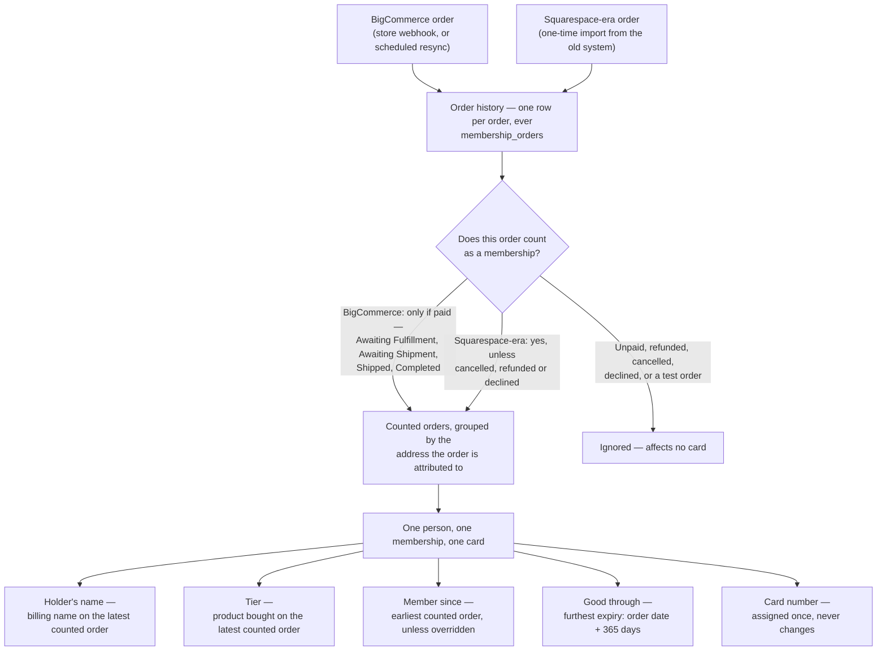
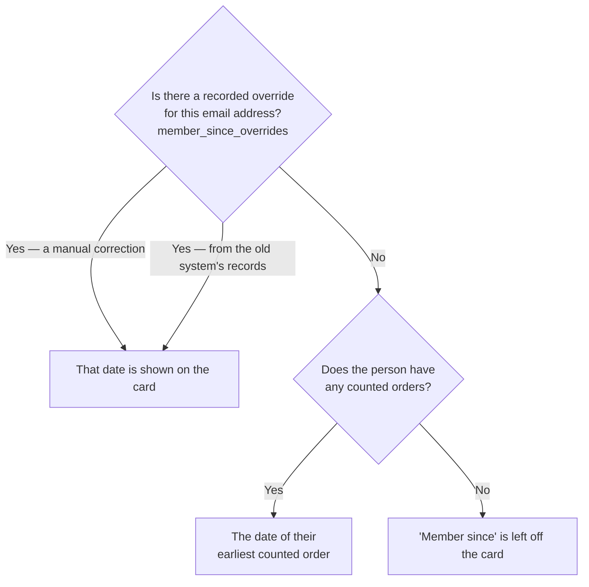

# Where Membership Card Information Comes From

This document is written for the membership committee. It explains, in plain
language, where every piece of information printed on a Los Verdes membership
card comes from, and exactly how the software decides whether someone counts
as a current member today.

Nothing here is a proposal. It is a description of what the code does right
now, so the rules can be confirmed or changed deliberately rather than
discovered by accident. Code and database names appear in `backticks` after
each plain-English statement, for anyone who wants to check a claim against
the source.

The last section, [Decisions worth confirming](#8-decisions-worth-confirming),
lists the places where the software had to pick a rule and where a different
club policy would be equally easy to implement. That is the part most likely
to need the committee's attention.

## 1. The short version

* Orders are the only raw material. Every card is rebuilt from a person's
  order history; the card itself stores no independent state.
* Two eras of orders feed the history: current BigCommerce orders, and
  Squarespace-era orders recovered once from the old system's database. Both
  land in the same table (`membership_orders`).
* Not every order counts. A BigCommerce order counts only once it is paid; a
  Squarespace-era order counts unless it was cancelled. Test orders never
  count.
* All of one person's counted orders collapse into a single membership and a
  single card. The card's "good through" date is the furthest expiry among
  them; "member since" is the earliest order, unless a recorded override says
  otherwise.
* A person is identified by email address. An order can be pointed at somebody
  other than the person who paid, which is how gift purchases work.

## 2. How it fits together

The rebuild happens in one place (`refreshMemberFromOrders()` in
`src/bigcommerce/sync.ts`). It runs whenever an order arrives or changes, when
the scheduled resync revisits an order, and when an order is re-attributed by
hand. Each run recomputes the whole membership from the whole history rather
than nudging the previous answer, which is why a refund or a correction takes
effect on its own, and why the result does not depend on the order in which
orders happen to arrive.

## 3. Each field on the card

The stored membership record (`members`) is what all card formats read from.
Apple Wallet passes, the "Save to Google Wallet" card, the emailed card image,
and the QR verification page all draw on the same record, so they cannot
disagree with each other.

### Holder's name

The billing name on the person's **most recent counted order**
(`deriveMembershipState()` in `src/bigcommerce/sync.ts`, taking `first_name`
and `last_name` from the latest order by date). It is shown as first and last
name joined with a space — the large field on the front of the pass
(`buildPassJson()` in `src/passkit/generator.ts`) and the card image
(`src/cardimage/template.ts`).

If that order carries no name — common for Squarespace-era rows, where the old
export did not always have one — the name already on file is kept, and for a
brand-new record the name from the order currently being processed is used
instead.

Two consequences worth noting. The name follows the store: a member who
updates their billing name at checkout sees the card follow on their next
purchase, and a member who never buys again keeps the name from their last
purchase indefinitely. And because an attributed gift order still carries the
*purchaser's* billing name, a gifted card can end up showing the giver's name
(see [section 7](#7-gift-purchases-and-re-attributed-orders)).

### Membership tier

The product bought on the **most recent counted order**, translated from its
SKU by a fixed table (`MEMBERSHIP_SKU_TIER_MAP` in `src/bigcommerce/sync.ts`).
Today that table has exactly one entry — SKU `LOSV-MEM-0001` means the
`standard` tier — because the store sells a single membership product. An
order containing no recognised membership SKU is not treated as a membership
order at all and is skipped entirely.

A Squarespace-era order whose SKU is not in that table leaves the tier as
whatever is already on file, or `standard` for a record being created from
scratch. The tier is printed on the card exactly as stored, so it currently
appears in lowercase.

### Member since

The earliest date the club has on record for this person, shown as month and
year only (for example "Jul 2021", via `formatMonthYear()` in
`src/lib/dateFormat.ts`). Two sources can supply it and they do not agree in
every case, so the precedence matters — [section 5](#5-member-since-and-its-precedence-chain)
covers it in full.

When neither source has a date, the field is left off the card entirely rather
than shown blank.

### Good through (the expiry date)

The furthest expiry among all of the person's counted orders, shown as a full
date (for example "Feb 17, 2024", via `formatShortDate()`).

Each order carries its own expiry, fixed when the order is recorded: exactly
365 days after the order was placed (`membershipExpiry()` in
`src/bigcommerce/orders.ts`, `MEMBERSHIP_DURATION_DAYS = 365`, stored as
`membership_orders.expires_on`). The same 365-day rule was applied to the
imported Squarespace-era orders (`src/legacy/import-sql.ts`), and it is
carried over deliberately from the old system's behaviour.

The card's date is then the latest of those per-order expiries. Nothing is
added up and nothing is stitched together: a second order does not extend the
first one's year, it simply contributes its own expiry to the comparison. This
is the mechanism behind renewals, and also the reason an early renewal can
lose a few days — see [section 6](#6-several-orders-one-membership-one-card).

If no order counts — every one refunded, say — the expiry is emptied and the
membership is no longer current.

### Card number and QR code

The card number (`Card #` on the back of the Apple pass, and the small line
under the QR code on the card image) is the membership record's own identifier
(`members.member_id`), a value of the form `LV-` followed by a random unique
string, for example `LV-6f1c8e40-0000-4000-8000-a1b2c3d4e5f6`. It is assigned
once, when the membership record is first created, and never changes
afterwards — not on renewal, not on a name change, not on a resync. It is also
the serial number baked into every Wallet pass issued for that person, which
is why it has to stay stable.

Deliberately, it is **not** derived from the store's customer number. Two
reasons, both from real data: every guest checkout shares customer number `0`,
and a gifted order carries the *buyer's* customer number, not the recipient's.
Neither identifies a member. Records are always found by email address, so the
card number never needs to be reproducible from anything else.

The QR code encodes a signed verification link for that card number. Scanning
it (and signing in) shows the holder's name and whether their membership is
current *right now* — computed live, not read off the card
(`src/member/verify-pass.tsx`, `lookupPassHolder()` in
`src/member/passHolder.ts`). Old Squarespace-era cards still in circulation
resolve the same way: the old card's serial is looked up
(`legacy_membership_cards`) to find the holder, and then the holder's current
membership is shown, not the dates printed on that old card. If that holder
has no current membership record at all, the old card's own dates are shown as
a last resort.

### What differs between card formats

| | Apple Wallet pass | Google Wallet card | Emailed card image |
| :--- | :--- | :--- | :--- |
| Holder's name | yes | yes | yes |
| Tier | yes | yes | yes |
| Member since | yes | yes | **no** |
| Good through | yes | yes | yes |
| Card number | on the back | as QR alt text | under the QR code |
| Status note | on the back, only when not active | pass state (active / expired / inactive) | not shown |

The card image (`src/cardimage/template.ts`) is the one that omits "member
since"; it shows name, tier, "Good through <date>", and the QR code.

## 4. How the software decides who is a current member

Two separate questions are involved, and they are answered in different
places.

**Does an individual order count as a membership?** This is
`COUNTS_AS_MEMBERSHIP` in `src/lib/membershipOrders.ts`. It is a single shared
rule used by the card rebuild, by the admin reports
(`src/admin/reportQueries.ts`), and by the order-attribution screens
(`src/admin/attribution.ts`), specifically so a card and a report can never
disagree about the same order.

**Is the person a current member today?** Their membership is current if the
card's expiry date is today or later and the record has not been revoked
(`isMembershipCurrent()` in `src/member/artifacts.ts`). Every gate that
matters — access to the member portal, emailing a card, the QR verification
page — checks the expiry date directly rather than trusting a stored
active/expired label, because that label is only recalculated when an order
sync happens to touch the record.

That stored label (`members.status`) is not decorative, though: it is what
decides whether an Apple pass carries an "Expired" note on its back, and what
Google Wallet is told about the card's state. Since it only moves when a sync
touches the record, a membership that lapsed without any order activity can
keep an `active` label until the next sync. The expiry date printed on the
card is still correct, and every access check still refuses — but the pass's
own status marking can lag behind reality for a while.

### The per-source counting rule

Order statuses are stored exactly as each store reported them, and the two
stores do not mean the same things by similar words. So the rule is applied
per source rather than as one list.

**BigCommerce orders count only when paid.** The statuses that count are
`Awaiting Fulfillment`, `Awaiting Shipment`, `Shipped` and `Completed`
(`PAID_BIGCOMMERCE_STATUSES`, decided 2026-09-17). Everything else is
excluded, and the exclusions fall into two groups: not yet paid
(`Incomplete`, `Pending`, `Awaiting Payment`) and money returned or the sale
undone (`Refunded`, `Cancelled`, `Declined`, `Disputed`, and any other status
the store may report). The list is an allow-list, so an unfamiliar BigCommerce
status does not confer membership.

**Squarespace-era orders count unless they were cancelled.** The statuses that
void one of these are `canceled`, `cancelled`, `refunded` and `declined`
(`VOID_LEGACY_STATUSES`); anything else counts, including a blank status,
which many imported rows have.

The reason the rules differ is specific rather than an oversight.
Squarespace's own vocabulary was `FULFILLED`, `PENDING` and `CANCELED`, and its
`PENDING` meant **paid but not yet shipped** — not BigCommerce's "we are still
waiting for payment". Applying BigCommerce's allow-list to those rows would
silently drop real historical members, and applying the Squarespace rule to
BigCommerce orders would hand out cards for orders nobody had paid for. The
Squarespace-era side also keeps the old system's rule, which was simply "count
it unless it was cancelled".

These orders are closed history: Squarespace is no longer accessible and those
rows will never change again.

### Test orders

A separate flag excludes test orders regardless of status (`test_mode = 0` is
required in every case). This came from Squarespace, which marked test
transactions; the imported rows carry the flag through
(`src/legacy/import-sql.ts`). BigCommerce orders recorded by the current sync
are always marked as not-test, so today the flag only ever excludes
Squarespace-era test transactions.

## 5. "Member since" and its precedence chain

"Member since" is the one field on the card with more than one possible
source, because the club's early history does not exist in the current store.

**The order-derived value.** Each time a membership is rebuilt, the earliest
counted order's date is stored on the record (`members.member_since`). This
includes Squarespace-era orders, so once the one-time import had loaded, this
value alone is often already correct.

**The override, which wins.** A separate table
(`member_since_overrides`, added in
`src/db/migrations/0005_legacy_export.sql`) holds authoritative dates that did
not come from current orders. When a card is rendered, the override is used if
one exists, and the order-derived value is used only if none does — a plain
"prefer the override" choice, visible as the `COALESCE` in the shared
membership lookup in `src/member/artifacts.ts`. Every card format goes through
that lookup, so the override applies everywhere consistently.

Overrides come from two places, recorded in the row's `source`:

* **The old system's records** (`legacy_postgres`). A one-time export of the
  old application's own "member since" value, which it computed as the
  earliest membership order it had for that person. For early members this is
  the only surviving record of when they joined, and it is loaded by the
  scripts under `scripts/legacy-export/`.
* **Manual corrections** (`manual`). Set by hand to correct or fill in
  anyone's date.

A manual correction outranks the imported value: re-running the legacy import
updates only rows that came from the import itself and leaves a manual row
alone (`buildImportStatements()` in `src/legacy/import-sql.ts`). There is at
most one override per email address, so the two sources never coexist for one
person — the manual row simply survives.

**On trustworthiness.** These sources are not equally reliable, and the
current rule does not rank them by reliability, only by origin:

* The order-derived date is the most auditable — it points at a specific
  order that counts today.
* The imported date was computed over *every* historical membership row for
  that person, without excluding cancelled or test orders. It can therefore be
  slightly earlier than the order history would justify.
* A manual date is as good as the judgement behind it, and is the right tool
  when a member's history genuinely predates the records.

Because the rule is "prefer the override", an override wins even when it is
*later* than the earliest counted order, which is not what "member since"
usually implies. See the questions in [section 8](#8-decisions-worth-confirming).

Changing an override immediately marks that member's card as stale, so the
next time their pass is fetched it is regenerated with the new date. That is
enforced by the database itself (the triggers in migration 0005), so it works
even when a date is corrected with hand-written SQL. Already-installed Wallet
passes pick the change up on their next routine update rather than being
pushed immediately.

## 6. Several orders, one membership, one card

One person's whole order history collapses into one membership record and one
card. The mechanics live in `refreshMemberFromOrders()` in
`src/bigcommerce/sync.ts`:

1. Every order attributed to that email address that counts as a membership
   is read.
2. Those orders are reduced to one set of card values
   (`deriveMembershipState()`): earliest order for "member since", furthest
   expiry for "good through", latest order for name and tier.
3. The existing membership record for that email address is updated in place,
   or a new one is created if there is none.

Three properties of this design are deliberate.

**An order is a separate thing from a membership.** Orders are history, kept
one row per order forever. A membership is a current summary, rebuilt on
demand. That separation is what lets a correction of any kind — a refund, a
re-attribution, a newly imported historical order — take effect simply by
recomputing, with no repair work and no risk of a stale card. It is also why
the card number is a random `LV-<unique id>` rather than anything derived from
a store customer number: a membership is not an order and does not inherit an
order's identifiers.

**Renewals extend by comparison, not by accumulation.** With two counted
orders, the card's expiry is the later of the two per-order expiries. A member
who renews after their previous year has ended gets a fresh year from the
purchase date. A member who renews a month early gets 365 days from the
purchase date, which is *not* the old expiry plus a year — the unused month is
not carried over. Buying two memberships at once does not produce two years
either; both orders expire on the same day, so the card shows one year.

**A lapsed member keeps their identity.** If every one of a person's orders
stops counting, their membership record is kept — and with it their card
number, their Wallet pass credentials, and their registered devices — with an
empty expiry, so the card is simply no longer current. Should they buy again,
the same card number comes back to life. Nothing is created for an address
with no counted orders and no existing record.

Alongside this, an update never touches a member's Wallet pass credentials or
their original creation date, and the "last updated" timestamp moves only when
something actually visible on the card changed. That last detail is what stops
a routine resync from making every member's phone re-download an identical
pass.

## 7. Gift purchases and re-attributed orders

Every order in the history records two email addresses:

* `order_email` — the address on the order itself, that is, the person who
  paid. Never changed.
* `member_email` — the address the club considers the member for that order.

Memberships are grouped by `member_email`, so that column alone decides which
card an order feeds. Normally the two are the same. They differ in two
situations: a **gift**, where one person buys a membership for another, and a
**changed address**, where a member's old order carries an email they no
longer use.

Re-pointing an order is an administrative action (`attributeOrder()` in
`src/admin/attribution.ts`). It does four things: updates the order's
`member_email`; appends a permanent audit record of the change — old address,
new address, which admin made it, an optional note, and when
(`membership_order_attributions`, migration 0009); rebuilds **both** people's
cards, since one loses that order's contribution and the other gains it; and
pushes a pass update to any device holding a card that changed.

For example, if an order recorded as `1001_bc` and placed by
`buyer@example.com` is attributed to `recipient@example.com`, that year's
expiry moves off the buyer's card and onto the recipient's, and the recipient
gets a membership record — and a new card — if they did not already have one.
If the buyer has other counted orders, their own card simply falls back to the
furthest expiry among those.

Two safeguards keep an attribution from being quietly undone. The routine
BigCommerce sync refreshes everything the store reports about an order but
deliberately never rewrites `member_email` (`recordMembershipOrder()` in
`src/bigcommerce/orders.ts`), so a resync cannot hand a gift back to its
buyer. And the one-time legacy import skips an order that has an attribution
recorded against it, so an admin's decision outranks the historical export
(`src/legacy/import-sql.ts`).

What attribution does *not* change is the name on the order. The billing name
stays the purchaser's, and since the card's holder name comes from the latest
counted order, a gift can leave the purchaser's name on the recipient's card.
This is listed as a question below.

## 8. Decisions worth confirming

Each of these is a point where the software had to choose a rule and where a
different club policy would be straightforward to implement. The current
behaviour is stated alongside each question, so the answer is a confirmation
or a change, not an open-ended design exercise.

1. **Should a paid-but-unshipped order confer membership immediately, or only
   once the order ships?** Currently membership starts as soon as the store
   marks an order paid — `Awaiting Fulfillment` and `Awaiting Shipment` both
   count — and the membership year is measured from the date the order was
   placed, not the date anything shipped. (A related wrinkle: the automatic
   card-delivery email is only sent once an order reaches `Completed`,
   so a member can be current for a while before the software emails them
   their card.)

2. **Should a refund or cancellation retroactively remove a membership?**
   Currently yes, and immediately: the order stops counting, so the card's
   expiry moves earlier or disappears, and the card stops verifying as
   current. If instead a refunded season should still count as membership for
   the year — for example a partial refund on a gift — that is a change to the
   counting rule.

3. **When someone renews early, should the new year extend from the old expiry
   or from the purchase date?** Currently from the purchase date. Renewing a
   month before expiry means that month is lost rather than added on.

4. **Should "member since" mean continuous membership, or the first time
   somebody ever joined?** Currently it means the first time ever. A member
   who joined in 2015, lapsed for five years, and rejoined last season carries
   a 2015 "member since" on their card, with nothing indicating the gap.

5. **When the historical records and the order history disagree about "member
   since", which should the card believe?** Currently the recorded override
   always wins, even when it is later than the earliest order that counts, and
   the imported historical dates were computed without excluding cancelled or
   test orders. An alternative worth considering is showing whichever date is
   earlier.

6. **Whose name belongs on a gifted card?** Currently the purchaser's, because
   the name comes from the billing details on the order. Re-attributing a gift
   moves the membership to the recipient but leaves the buyer's name on it
   until the recipient places an order of their own. If the recipient's name
   should appear, the committee needs a way to record it.

7. **Is an email address the right definition of a person?** Currently it is:
   one address, one membership, one card. A member who changes address is two
   people to the software until their old orders are re-attributed, and a
   recorded "member since" override follows the old address rather than the
   person.

8. **Does the club need a way to withdraw a membership before it expires?**
   Currently there is none. The data model has a "revoked" state and the
   access checks respect it, but nothing in the software ever sets it, and the
   routine order sync would overwrite it if it were set by hand. Revocation is
   already tracked as post-cutover work
   ([#31](https://github.com/los-verdes/card-losverd-es/issues/31)); what it
   should mean in practice is a policy question.

9. **Should a historical order with no recorded status still count?**
   It depends on which era it came from, and that asymmetry needs a decision
   before cutover. A Squarespace-era row with no status counts, because many
   imported rows have none and excluding them would drop real historical
   members. But the same blank status on a **BigCommerce-era** row does not
   count, because that side requires a positively paid status.

   This matters because the one-time import classifies any order whose id ends
   in `_bc` as a BigCommerce order and fills its status from the old system's
   own fulfilment field, which is frequently empty. Those rows therefore land
   under the strict paid-only rule with nothing to satisfy it, and the current
   store's resync does not revisit orders that old, so they would stay
   uncounted. The effect would be members quietly losing membership at
   cutover — the one outcome the migration is most concerned to avoid.

   Worth establishing from the real export, before it is loaded: how many
   imported `_bc` rows have no usable status. If the answer is "more than
   none", the rule needs to distinguish an order the store reported as unpaid
   from one whose status was simply never recorded. The data already supports
   that distinction — every order records whether it arrived through the store
   sync or the historical import (`membership_orders.first_seen_via`).
