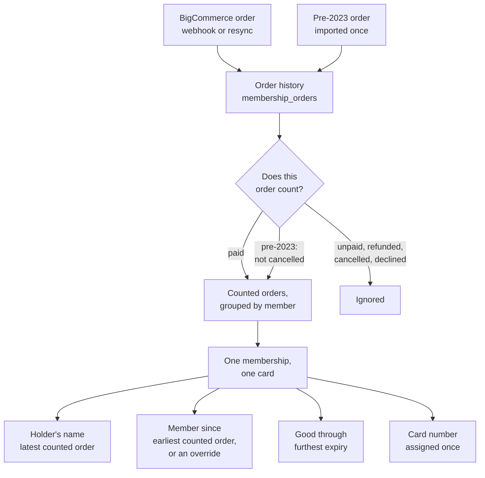

# Where Membership Card Information Comes From

This document defines how membership status is derived and displayed across digital membership cards for Los Verdes. The
primary audiences are:

- **The Merch Team** (`merchteam@losverdesatx.org`): Store administrators, primary data-source managers, and keepers of
  the realm.
- **The Membership Committee** (`mc@losverdesatx.org`): Stewards of member standing, code of conduct enforcement, and
  disciplinary processes.

Deciding membership card attributes is functionally identical to establishing active membership status. This document
specifies the current implementation and outlines open policy choices in the [Appendix - Decisions worth
confirming](#appendix-decisions-worth-confirming) (this appendix in particular would greatly benefit from discussion and
feedback.)

---

## 1. Summary

- **Source of truth:** Membership derives from membership product orders placed on the Los Verdes store
  (`store.losverdesatx.org/membership/`).
  - All counted membership orders for an individual resolve into a single aggregate "membership".
  - Members are identified uniquely by email address (order email by default, unless manually re-attributed).
  - A membership remains active until `<most recent counted order date> + 365 days` (unless revoked).
- **Card application behavior:**
  - Card attributes reflect this aggregate order history.
  - "Member since" displays the earliest qualifying order date (unless overridden).
  - Only orders containing explicitly configured membership SKUs are recorded.

```mermaid
%% Keep every label to a few words a line. Mermaid no longer grows a box to
%% fit its text (mermaid-js/mermaid#7354), so a long label is silently clipped
%% when this renders on GitHub. Detail belongs in the prose, not in the boxes.
flowchart TD
    BC["BigCommerce order<br/>webhook or resync"] --> HIST
    SQ["Pre-2023 order<br/>imported once"] --> HIST
    HIST["Order history<br/>membership_orders"]
    HIST --> COUNT{"Does this<br/>order count?"}
    COUNT -->|"paid"| KEEP
    COUNT -->|"pre-2023:<br/>not cancelled"| KEEP
    COUNT -->|"unpaid, refunded,<br/>cancelled, declined"| DROP["Ignored"]
    KEEP["Counted orders,<br/>grouped by member"]
    KEEP --> CARD["One membership,<br/>one card"]
    CARD --> F1["Holder's name<br/>latest counted order"]
    CARD --> F2["Member since<br/>earliest counted order,<br/>or an override"]
    CARD --> F3["Good through<br/>furthest expiry"]
    CARD --> F4["Card number<br/>assigned once"]
```

---

## 2. Membership Qualification Rules

A person holds current membership if their furthest qualifying order expiry is today or later and the record has no
active revocation or expulsion flag (`isMembershipCurrent()`).

### Qualifying Statuses

Orders must carry an explicit paid status (`PAID_BIGCOMMERCE_STATUSES`) to grant membership:

- **Qualifying:** `Awaiting Fulfillment`, `Awaiting Shipment`, `Partially Shipped`, `Shipped`, `Completed`, and
  `Partially Refunded` while the membership itself wasn't refunded.
- **Non-Qualifying:** `Incomplete`, `Pending`, `Awaiting Payment`, `Refunded`, `Cancelled`, `Declined`, `Disputed`.

*Note on partial refunds:* the store reports how much of each line item was refunded, so a Partially Refunded order
counts while its membership wasn't refunded (a refunded scarf leaves the membership in place) and stops counting once it
was. Until an order is next read from the store, which the weekly full sync does for every order, its refund is unknown
and it doesn't count.

### Membership Lifecycle

Membership is tracked according to these principles:

- **Non-accumulating terms:** Membership expirations do not stack. Renewing 30 days prior to expiration sets the new
  term to `purchase_date + 365 days`, shortening the overall coverage window by 30 days.
- **Persistent identities:** Lapsed members retain their UUID (`member_id`), push tokens, and pass configurations
  indefinitely with an empty expiry. A subsequent renewal re-activates the existing card.
- **Decoupled data models:** Orders are the history; memberships are computed snapshots. (i.e., orders and memberships
  are tracked separately)

#### Revocations & Expulsions

While not common, disciplinary actions supersede order status and come from a Membership Committee decision (which an
admin then records).

- **Revocation:** Invalidates a specific card record without deleting underlying order data.
- **Expulsion:** Disables member login and blocks future cards issued to that email address.

---

## 3. Membership Card Fields & Verification

Membership cards are available in multiple formats. We attempt to keep the same fields present between these formats and
that is tracked in the table below:

| | Apple Wallet pass | Google Wallet card | Emailed card image |
| :--- | :--- | :--- | :--- |
| Holder's name | yes | yes | yes |
| Member since | yes | yes | yes |
| Good through | yes | yes | yes |
| Card number | on the back | as QR alt text | under the QR code |
| Status note | on the back, only when not active | pass state (active / expired / inactive) | not shown |
| Card theme's name | on the back | among the details | not shown (the card is drawn in it) |

### Field Details

- **Holder's Name:** Defaults to the billing name on the most recent counted order. A member or an admin may set a
  custom display name (up to 64 characters). A member who updates their billing name at checkout will see it reflected
  on their next membership purchase; however, an attributed gift order retains the purchaser’s billing name, which can
  result in a gifted card displaying the buyer's name. (Some of these values were imported from the old site and don't
  map directly to an order. Imported names that matched the orders' name changed nothing and have been removed.)
- **Good Through:** Calculated as `order_date + 365 days` per qualifying order. The displayed date is the latest among
  all qualifying orders. Terms do not accumulate consecutively.
- **Card Number & QR Code:** The QR code links to a page that says whether the membership is current right now (a public
  scan sees only "Valid" or "Not a current membership"). Cards issued by the old site still scan. The card number is
  assigned once and never changes.

### "Member Since" Precedence

Given that folks are passionate about their "member since" dates, we have options for adjusting this value. When
determining the "Member Since" date, the site uses this order:

1. `Manual Admin Override` - A date set by an admin manually; recorded in the audit logs
2. `Legacy Import Override` - Historical join dates imported from the old site. Those that matched the member's
   orders, or belonged to someone with no Squarespace-era order, have been removed: on 2026-10-02 that was every one.
3. `Earliest Counted Order` - Timestamp of the earliest qualifying order on file; the default option if the preceding
   options don't fit

Only a manual override can be removed by an admin; an imported date can be corrected over but not removed.

### Card Themes

Members can choose a theme to change how their card looks: the colours and scarf artwork of a membership year, or
`classic` (the original look).

- **Who can use which:** the year of each membership they bought, their "member since" year, a subgroup's theme (e.g.
  Los Pringles) while they're in its Slack channel, and `classic`.
- **Default theme:** each member's "member since" year.
- **Losing access** (e.g. leaving the Slack channel): the card falls back to the default theme.
- **Choosing:** members on their card page; admins on the member's admin page (an admin's choice is logged; a member's
  own is not).

---

## 4. Signing In & the Store

This section describes the ways a member reaches their card, including linking it to their LV store account. None of it
changes who is a member.

- **Sign-in:** with Google or Apple. The account's email finds the membership under that address.
- **Bought under another address** (e.g. if someone logs in with Apple's Hide My Email feature): the member can claim
  it. A link is mailed to the membership's address, and following it while signed in links the two.
- **Without signing in:** `/email-card` mails a current card to the membership's own address. The page never says
  whether an address belongs to a member.
- **Store accounts (see: [#38](https://github.com/los-verdes/card-losverd-es/issues/38)):** a member can connect their
  store account once, while signed in to both in the same browser. After that, a "Membership card" link in the store's
  top navbar / account menu signs them straight in to the card site, and their store account pages show their card.
  - **Never matched by email or orders:** only the member makes the connection, so a gift buyer reaches their own card,
    never the recipient's. The store's email appears on the sign-in page only as a hint.
  - **Disconnecting:** by the member on their card page, or by an admin on the member page. Both are logged.
  - **Status:** live on staging; off in production until released.

---

## 5. Gifts & Order Re-Attribution

Orders maintain two email fields:

- `order_email`: The billing email on the store transaction.
- `member_email`: The address to which membership entitlement is assigned.

An admin re-attributes an order from its page: both people's cards are recalculated, their wallet passes update, the
change is logged, and syncs never undo it.

This is used for gifts (someone orders a membership for somebody else), and for a member whose older orders carry an
address they no longer use. (Ideally folks purchase memberships under their own store account / email address though.)

---

## 6. Order Processing & Synchronization

### Membership Order Criteria

An order counts as a membership order when a line item matches an entry in `MEMBERSHIP_SKUS`: `LOSV-MEM-0001` (physical
pack with merchandise) or `LOSV-DIGI-5000` (digital-only). Both SKUs generate identical memberships and cards.
Non-matching orders are ignored.

### One Membership per Order Constraint

The current schema expects **one membership product per order**. The storefront enforces this constraint at checkout.
However, it is a per-product constraint, so it must be deliberately maintained if membership products are updated.

As incoming orders are processed, we record a `membership_orders.membership_units` column. Any active order containing
multiple membership units is flagged on the admin report under "More than one membership" until addressed or expired.
(This isn't expected to come up normally.)

### Authoritative Source

BigCommerce is authoritative; the app maintains a downstream replica. Two fields originate within the application rather
than the store:

- `membership_orders.member_email`: Attribution override (i.e., who a membership order belongs to; never overwritten by
  syncs).
- `membership_orders.missing_since`: Flag set when an order ceases to return from the store API. (not expected to happen
  typically; noted for completeness)

The card site is configured to receive order update events via BigCommerce webhooks and runs periodic resyncs to catch
missed deliveries.

Qualifying orders are grouped by member email. A single function (`refreshMemberFromOrders()` in
`src/bigcommerce/sync.ts`) recalculates the full membership state whenever an order updates, a scheduled sync executes,
or an order is manually re-attributed.

Here is generally how we map membership orders to members:

1. Read in all qualifying orders matching the email address.
2. Derive card attributes from these orders via `deriveMembershipState()`.
3. Update or create the member record in `members`.

### Sync Strategy

This is how we ensure our accounting of membership reflects the authoritative source / LV store:

- **Re-reading is idempotent:** Processing an order overwrites the local row by order ID; multiple passes produce no
  duplicate state.
- **Direct overwrite:** Ingested store fields replace local copies rather than merging.
- **Routine reconciliation:** A routine sync runs every six hours for recent changes, and a full-store sync runs weekly
  early Sunday morning.
- **Missing orders:** If an order disappears from BigCommerce, it is flagged under "Missing from BigCommerce" rather
  than deleted, preserving current cards. (Again, this isn't expected to happen.)
- **Manual resync:** Admins can trigger a manual fetch for any single order via the **Re-read from BigCommerce** button
  without notifying (i.e., without emailing) the associated member. That includes an order the card site hasn't seen
  yet: **Find an order** takes any order ID, and reading it in records it as a sync would. If the order carries no
  membership, the page lists the SKUs it does carry.

### Known Edge Cases

- **Archived orders:** Archiving (soft deleting) an order in BigCommerce does not remove or flag it locally; it
  continues counting toward membership.
- **Unlisted SKUs:** Orders using an unlisted SKU will not issue cards or trigger reports. Adding new membership tiers
  requires updating `MEMBERSHIP_SKUS` in code.
- **MiniBC renewals:** Recurring subscriptions managed through MiniBC are tracked and reported on but we do not
   currently use this information directly when considering membership.

---

## 7. Audit Logging

Administrative interventions are permanently recorded in the audit log (`/admin/audit`).

- **Logged actions:** Card name modifications, "Member since" overrides, order re-attributions, card email dispatches,
  revocations / expulsions (and lifting either), card themes set or cleared by an admin, store accounts connected or
  disconnected, admin access granted or removed.
- **Entry schema:** Timestamp, target user, actor (admin username, `site automation`, `command line`, `previous site
  import`, or `database migration`), action type, and previous/new values.
- **Data retention:** Audit records are immutable and persist when state tables are modified or cleared. Administrative
  CSV exports of the audit log generate an audit event noting actor and exported row count.
- **Excluded events:** High-frequency, deterministic automated events (standard order webhook ingestion, scheduled sync
  runs, pass re-renders) are omitted.

---

## Appendix: Decisions worth confirming

1. **When does membership activate?**
   - Current: Immediately upon payment (`Awaiting Fulfillment`).
   - Alternatives: Delay activation until processed (`Shipped` or `Completed` statuses). A no-merch order has nothing to
     ship, so it would activate only once marked `Completed`.
2. **Do refunds revoke membership retroactively?**
   - Current: Yes, when the membership is what was refunded: the order stops counting at once. Refunds of other items on
     the order leave it counting.
   - Alternatives: Keep a refunded membership current for the rest of its year.
3. **How should early renewals extend terms?**
   - Current: 365 days from the purchase date (losing overlapping days).
   - Alternatives: Add 365 days to the previous `expires_on` date.
4. **Does "Member Since" represent continuous tenure?**
   - Current: No; displays the earliest documented join date regardless of lapses.
   - Alternatives: Reset date following a lapse; indicate broken tenures.
5. **How should conflicting "Member Since" dates resolve?**
   - Current: Overrides always win, even if later than earliest counted order.
   - Alternatives: Automatically display whichever date is earlier.
6. **What restrictions apply to display names?**
   - Current: Unrestricted free-text up to 64 characters.
   - Alternatives: Add profanity filters, require admin approval, or lock to billing names.
   - Deciders?: Membership Committee
7. **Is email address the proper member identifier?**
   - Current: Yes; one email equals one membership entity.
   - Alternatives: Support multi-email linking or separate member accounts.
8. **How should sanctions be structured?**
   - Current: Binary revocation (card) and expulsion (email).
   - Alternatives: Introduce temporary suspensions, disciplinary tiers, or appeal logs.
   - Deciders?: Membership Committee
9. **Should archived orders confer membership?**
   - Current: Yes; archived orders continue counting.
   - Alternatives: Treat archived orders as cancelled or route to an admin review queue.
   - Deciders?: Merch Team
10. **Should a membership that renews automatically stay current while its renewal is being charged?**
    - Current: No grace period; runs strictly 365 days, which can cause a 1-day lapse during leap years (Feb 29) or
      temporary lapses during failed payment retries.
    - Alternatives: Introduce a multi-day grace window for active subscriptions, balanced against conferring unearned
      access if renewal fails.
    - Deciders?: Merch Team w/ Membership Committee

---

## Appendix: Legacy Orders (Pre-February 2023)

Orders imported from Squarespace (prior to February 2023) use static, precomputed verdicts stored in
`membership_orders.frozen_counts`.

- **Qualification rule:** Counted unless status was explicitly `canceled`, `cancelled`, `refunded`, or `declined`.
  (Squarespace marked paid, unshipped orders as `PENDING`, whereas BigCommerce uses `Pending` for unpaid transactions).
- **Scope:** Legacy Squarespace orders establish historical "Member since" dates.
