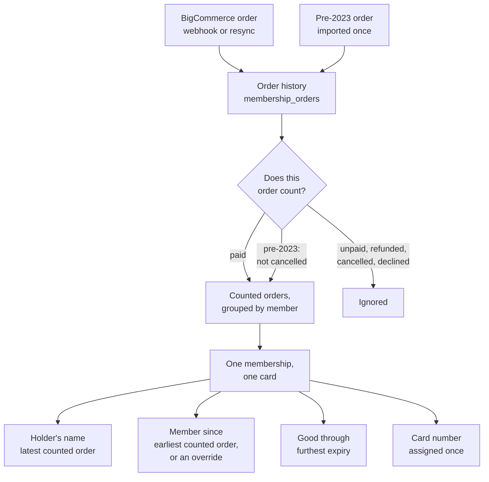

# Where Membership Card Information Comes From

This document defines how membership status is derived and displayed across digital membership cards for Los Verdes. The
primary audiences are:

- **The Merch Team** (`merchteam@losverdesatx.org`): Store administrators and primary data-source managers.
- **The Membership Committee** (`mc@losverdesatx.org`): Stewards of member standing, code of conduct enforcement, and
  disciplinary processes.

Deciding membership card attributes is functionally identical to establishing active membership status. This document
specifies the current implementation and outlines open policy choices in **Section 9**.

The last section, [Decisions worth confirming](#10-decisions-worth-confirming), gathers the places where the app had to
pick a rule and where a different policy would be equally easy to implement. This section in particular is seeking
feedback from any interested folks.

---

## 1. Summary

- **Source of truth:** Membership derives from membership product orders placed on the Los Verdes store
  (`store.losverdesatx.org/membership/`).
  - All counted membership orders for an individual resolve into a single aggregate membership.
  - Members are identified uniquely by email address (order email by default, unless manually re-attributed).
  - A membership remains active until `<most recent counted order date> + 365 days` (unless revoked).
- **Card application behavior:**
  - Card attributes reflect this aggregate order history.
  - "Member since" displays the earliest qualifying order date (unless overridden).
  - Only orders containing explicitly configured membership SKUs are recorded.

```mermaid
%% Keep every label to a few words a line. Mermaid no longer grows a box to
%% fit its text (mermaid-js/mermaid#7354), so a long label is silently clipped
%% when this renders on GitHub. Detail belongs in the prose, not in the boxes.
flowchart TD
    BC["BigCommerce order<br/>webhook or resync"] --> HIST
    SQ["Pre-2023 order<br/>imported once"] --> HIST
    HIST["Order history<br/>membership_orders"]
    HIST --> COUNT{"Does this<br/>order count?"}
    COUNT -->|"paid"| KEEP
    COUNT -->|"pre-2023:<br/>not cancelled"| KEEP
    COUNT -->|"unpaid, refunded,<br/>cancelled, declined"| DROP["Ignored"]
    KEEP["Counted orders,<br/>grouped by member"]
    KEEP --> CARD["One membership,<br/>one card"]
    CARD --> F1["Holder's name<br/>latest counted order"]
    CARD --> F2["Member since<br/>earliest counted order,<br/>or an override"]
    CARD --> F3["Good through<br/>furthest expiry"]
    CARD --> F4["Card number<br/>assigned once"]
```

---

## 2. System Architecture

The application receives order events via BigCommerce webhooks on order updates (`POST /bigcommerce/order-webhook`) and
runs periodic resyncs to catch missed deliveries.

Qualifying orders are grouped by member email. A single calculation engine (`refreshMemberFromOrders()` in
`src/bigcommerce/sync.ts`) recalculates the full membership state whenever an order updates, a scheduled sync executes,
or an order is manually re-attributed.

---

## 3. Order Processing & Synchronization

### Membership Order Criteria

An order counts as a membership order when a line item matches an entry in `MEMBERSHIP_SKUS`: `LOSV-MEM-0001` (physical
pack with merchandise) or `LOSV-DIGI-5000` (digital-only). Both SKUs generate identical memberships and cards.
Non-matching orders are ignored.

### One Membership per Order Constraint

The current schema expects **one membership product per order**. The storefront enforces this constraint at checkout.

The ingestion pipeline records `membership_orders.membership_units`. Any active order containing multiple membership
units is flagged on the admin report under "More than one membership" until addressed or expired.

### Authoritative Source

BigCommerce is authoritative; the app maintains a downstream replica. Two fields originate within the application rather
than the store:

- `membership_orders.member_email`: Attribution override (never overwritten by syncs).
- `membership_orders.missing_since`: Flag set when an order ceases to return from the store API.

### Sync Strategy

- **Re-reading is idempotent:** Processing an order overwrites the local row by ID; multiple passes produce no duplicate
  state.
- **Direct overwrite:** Ingested store fields replace local copies rather than merging.
- **Routine reconciliation:** A routine sync runs every six hours for recent changes, and a full-store sweep
  (`sync_subscriptions_etl`) runs weekly early Sunday morning.
- **Missing orders:** If an order disappears from BigCommerce, it is flagged under "Missing from BigCommerce" rather
  than deleted, preserving current cards.
- **Manual resync:** Admins can trigger a manual fetch for any single order via the **Re-read from BigCommerce** button
  without notifying the member.

### Known Edge Cases

- **Archived orders:** Archiving (soft deleting) an order in BigCommerce does not remove or flag it locally; it
  continues counting toward membership.
- **Unlisted SKUs:** Orders using an unlisted SKU will not issue cards or trigger reports. Adding new membership tiers
  requires updating `MEMBERSHIP_SKUS` in code.
- **MiniBC renewals:** Recurring subscriptions managed through MiniBC are tracked and reported on but we do not currently
   use this information directly when considering membership.
---

## 4. Card Fields & Verification

All formats (Apple Wallet, Google Wallet, card images, and QR verification pages) resolve through a shared query
(`MEMBER_SELECT` in `src/member/artifacts.ts`). We attempt to keep parity between the formats and that is tracked in
this table:

| | Apple Wallet pass | Google Wallet card | Emailed card image |
| :--- | :--- | :--- | :--- |
| Holder's name | yes | yes | yes |
| Member since | yes | yes | yes |
| Good through | yes | yes | yes |
| Card number | on the back | as QR alt text | under the QR code |
| Status note | on the back, only when not active | pass state (active / expired / inactive) | not shown |
| Card theme's name | on the back | among the details | not shown (the card is drawn in it) |

### Field Details

- **Holder's Name:** Defaults to the billing name on the most recent counted order. A member or an admin
  may set a custom display name (up to 64 characters via `member_display_names`). A member who updates their billing
  name at checkout will see it reflected on their next membership purchase; however, an attributed gift order retains
  the purchaser’s billing name, which can result in a gifted card displaying the buyer's name (see Section 8).
- **Good Through:** Calculated as `order_date + 365 days` per qualifying order. The displayed date is the latest among
  all qualifying orders. Terms do not accumulate consecutively.
- **Card Number & QR Code:** Uses a persistent UUID generated upon initial record creation. The card number is not
  derived from the store customer ID because guest checkouts share ID 0 and gifted orders retain the buyer’s customer
  ID. The QR code encodes a signed URL to `src/member/verify-pass.tsx`. Public scans return binary validity ("Valid" or
  "Not a current membership"); specific lapse or revocation states require signed-in admin access.

### Card Themes

- **Season themes:** Scarf artwork and color palettes exist for 2020, 2021, 2022, and 2023; fallback is `'classic'`.
- **Eligible themes:** Years of purchased memberships, "Member Since" year, active Slack subgroup channels (e.g.
  `#los-pringles`), and `'classic'`.
- **Subgroup validity:** Active while the member's email remains in the Slack channel; leaving reverts to default.
- **Persistence:** Stored in `member_card_themes` to preserve choices across sync rebuilds; controlled via
  `CARD_THEME_CHOICE` setting.

---

## 5. Membership Qualification Rules

A person holds current membership if their furthest qualifying order expiry is today or later and the record has no
active revocation or expulsion flag (`isMembershipCurrent()`).

### Qualifying Statuses

Orders must carry an explicit paid status (`PAID_BIGCOMMERCE_STATUSES`) to grant membership:

- **Qualifying:** `Awaiting Fulfillment`, `Awaiting Shipment`, `Partially Shipped`, `Shipped`, `Completed`.
- **Non-Qualifying:** `Incomplete`, `Pending`, `Awaiting Payment`, `Refunded`, `Partially Refunded`, `Cancelled`,
  `Declined`, `Disputed`.

*Note on partial refunds:* Partially Refunded orders do not grant membership because the system cannot verify which line
item was refunded. This policy should be monitored, as it risks revoking membership for multi-item orders where only
merchandise was refunded.

### Revocations & Expulsions

Disciplinary actions supersede order status and require Membership Committee execution:

- **Revocation (`revoked_cards`):** Invalidates a specific card record without deleting underlying order data.
- **Expulsion (`expelled_people`):** Disables member login and blocks future cards issued to that email address.

---

## 6. "Member Since" Precedence

When determining the "Member Since" date, the system evaluates sources in the following precedence order:

1. `Manual Admin Override` (`member_since_overrides`, `source = 'manual'`)
2. `Legacy Import Override` (`member_since_overrides`, `source = 'legacy_postgres'`)
3. `Earliest Counted Order` (`members.member_since`)

*(Implemented via `COALESCE` in `src/member/artifacts.ts`).*

- **Order-derived date:** The timestamp of the earliest qualifying order on file.
- **Legacy import:** Historical dates imported from Squarespace/Postgres records (pre-February 2023).
- **Manual override:** Administrative entry via the admin dashboard, requiring an audit note. An override replaces any
  prior value.

---

## 7. Aggregation & Lifecycle

1. Ingest all qualifying orders matching the email address.
2. Reduce rows to card attributes via `deriveMembershipState()`.
3. Update or create the member record in `members`.

- **Decoupled data models:** Orders remain historical logs; memberships are computed snapshots.
- **Non-accumulating terms:** Expirations do not stack. Renewing 30 days prior to expiration sets the new term to
  `purchase_date + 365 days`, shortening the overall coverage window by 30 days.
- **Persistent identities:** Lapsed members retain their UUID (`member_id`), push tokens, and pass configurations
  indefinitely with an empty expiry. A subsequent renewal re-activates the existing card.

---

## 8. Gifts & Order Re-Attribution

Orders maintain two email fields:

- `order_email`: The billing email on the store transaction.
- `member_email`: The address to which membership entitlement is assigned.

Re-attributing an order (`attributeOrder()` in `src/admin/attribution.ts`) updates `member_email`, records an entry in
`membership_order_attributions`, recalculates the membership records for both donor and recipient, and pushes updates to
installed wallet passes. The `member_email` field is protected against automated overwrite during routine BigCommerce
sync passes.

---

## 9. Signing In & the Store

How a person reaches their card. None of it changes who is a member.

- **Sign-in:** with Google or Apple. The account's email finds the membership under that address (`findMembershipsForUser()` in `src/member/portal.tsx`).
- **Bought under another address** (e.g. Apple's Hide My Email): the member can claim it. A link is mailed to the
  membership's address, and following it while signed in links the two (`members.user_id`,
  `src/member/claimMembership.tsx`).
- **Without signing in:** `/email-card` mails a current card to the membership's own address. The page never says whether an address belongs to a member.
- **Store accounts (#38):** a member can connect their store account once, while signed in to both in the same browser.
  After that, "Membership card" in the store's header and account menu signs them straight in, and their store account
  pages show their card.
  - **Never matched by email or orders:** only the member makes the connection, so a gift buyer reaches their own card,
    never the recipient's. The store's email appears on the sign-in page only as a hint.
  - **Disconnecting:** by the member on their card page, or by an admin on the member page. Both are logged.
  - **Status:** live on staging; off in production until released.

---

## 10. Decisions worth confirming

1. **When does membership activate?**
   - Current: Immediately upon payment (`Awaiting Fulfillment`).
   - Alternatives: Delay activation until physical fulfillment (`Shipped`).
2. **Do refunds revoke membership retroactively?**
   - Current: Yes; order stops counting immediately upon refund status.
   - Alternatives: Retain active status through the season for partial refunds.
3. **How should early renewals extend terms?**
   - Current: 365 days from the purchase date (losing overlapping days).
   - Alternatives: Add 365 days to the previous `expires_on` date.
4. **Does "Member Since" represent continuous tenure?**
   - Current: No; displays the earliest documented join date regardless of lapses.
   - Alternatives: Reset date following a lapse; indicate broken tenures.
5. **How should conflicting "Member Since" dates resolve?**
   - Current: Overrides always win, even if later than earliest counted order.
   - Alternatives: Automatically display whichever date is earlier.
6. **What restrictions apply to display names?**
   - Current: Unrestricted free-text up to 64 characters.
   - Alternatives: Add profanity filters, require admin approval, or lock to billing names.
7. **Is email address the proper member identifier?**
   - Current: Yes; one email equals one membership entity.
   - Alternatives: Support multi-email linking or separate member accounts.
8. **How should sanctions be structured?**
   - Current: Binary revocation (card) and expulsion (email).
   - Alternatives: Introduce temporary suspensions, disciplinary tiers, or appeal logs.
9. **Should archived orders confer membership?**
   - Current: Yes; archived orders continue counting.
   - Alternatives: Treat archived orders as cancelled or route to an admin review queue.
10. **Should a membership that renews automatically stay current while its renewal is being charged?**
    - Current: No grace period; runs strictly 365 days, which can cause a 1-day lapse during leap years (Feb 29\) or
      temporary lapses during failed payment retries.
    - Alternatives: Introduce a multi-day grace window for active subscriptions, balanced against conferring unearned
      access if renewal fails.

---

## 11. Audit Logging

Administrative interventions are permanently recorded in the audit log (`/admin/audit`).

- **Logged actions:** Card name modifications, "Member since" overrides, order re-attributions, card email dispatches,
  revocations, and expulsions.
- **Entry schema:** Timestamp, target user, actor (admin username, `site automation`, or `command line`), action type,
  and previous/new values.
- **Data retention:** Audit records are immutable and persist when state tables are modified or cleared. Administrative
  CSV exports of the audit log generate an audit event noting actor and exported row count.
- **Excluded events:** High-frequency, deterministic automated events (standard order webhook ingestion, scheduled
  sync runs, pass re-renders) are omitted.

---

## Appendix: Legacy Orders (Pre-February 2023\)

Orders imported from Squarespace (prior to February 2023\) use static, precomputed verdicts stored in
`membership_orders.frozen_counts`.

- **Qualification rule:** Counted unless status was explicitly `canceled`, `cancelled`, `refunded`, or `declined`.
  (Squarespace marked paid, unshipped orders as `PENDING`, whereas BigCommerce uses `Pending` for unpaid transactions).
- **Scope:** Legacy Squarespace orders establish historical "Member since" dates and resolve legacy card QR scans via
  `legacy_membership_cards`. They cannot confer active membership today.
