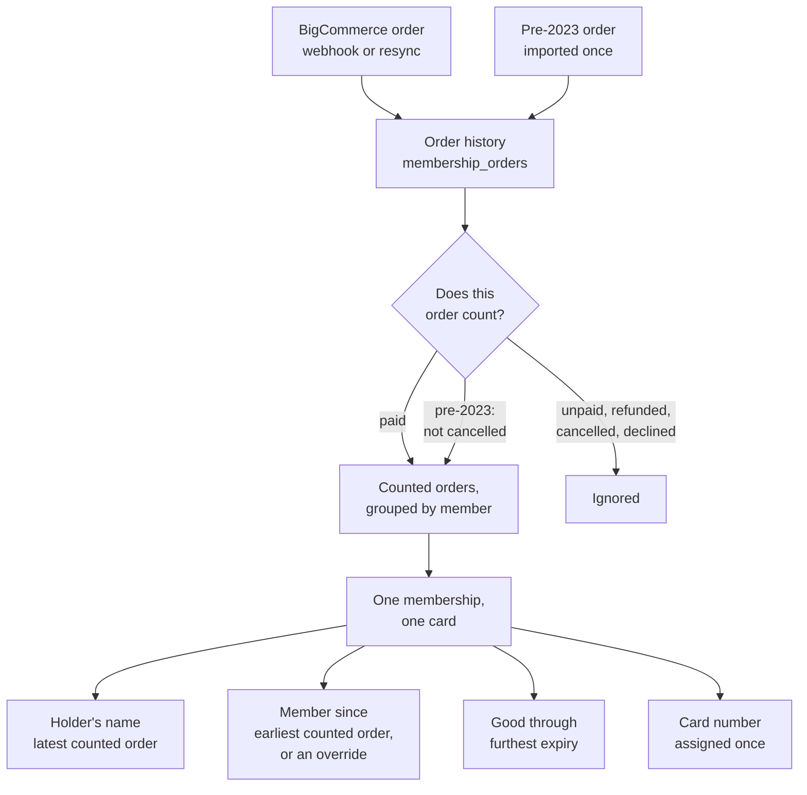
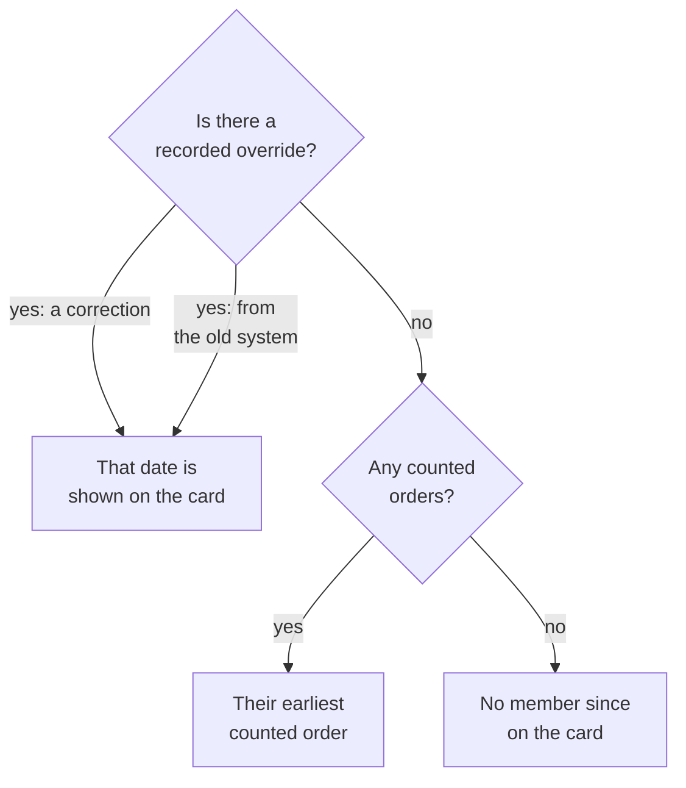

# Where Membership Card Information Comes From

This document is written for Los Verdes and its members. In particular, these
groups within Los Verdes are the primary audience:

* the Merch Team: they administer the storefront (which is the primary data
source for membership cards) and answer membership questions and the like that
arrive at `merchteam@losverdesatx.org`.
* the Membership Committee (`mc@losverdesatx.org`): they have "Membership" in
their name, and some membership processes are explicitly their purview (for
instance, anything that settles a person's standing in the group, such as
disciplinary action.)

It turns out that deciding what is on someone's "membership card" is effectively
the same as deciding who is an active Los Verdes member. So we have documented
the membership card site's ("app's") current implementation here both for
reference _and also_ to invite feedback and proposals to change that
implementation / rules for deciding membership.

The last section, [Decisions worth confirming](#9-decisions-worth-confirming),
gathers the places where the app had to pick a rule and where a different
policy would be equally easy to implement. This section in particular is seeking
feedback from any interested folks.

## 1. The short version

* Membership is derived from membership orders made on the [Los Verdes store](https://store.losverdesatx.org/membership/).
  * All of a person's counted membership orders collapse into a single "membership".
  * Members are identified by email address (by default the order's email but they can be attributed to another email)
  * A membership is active until `<most recent counted order date>` + `365 days` (unless it has been revoked; see [section 5](#5-how-the-app-decides-who-is-a-current-member))
* In this app:
  * membership card content is based on this exact same order history
  * on cards, the "member since" field is the earliest order's date (unless a recorded override says
  otherwise)
  * only orders containing a membership product are considered at all. For instance,
    an order for a shirt isn't recorded here. (ref: [section 3](#3-what-an-order-is-and-where-it-comes-from)).

Note: orders from before February 2023, when Los Verdes moved from Squarespace to
BigCommerce for membership orders, are described in [the appendix](#appendix-orders-from-before-bigcommerce).

## 2. How it fits together

The membership card app learns of orders through incoming notifications from the
store (specifically incoming webhooks from BigCommerce whenever an order is updated).
It also runs regular resyncs to catch any order update notifications that are
lost along the way.

As orders come in, we check to see if they count for membership (covered in
[the next section](#3-what-an-order-is-and-where-it-comes-from)). For the
orders that do count, we group them by member and use that aggregate information
to decide facts about their membership:

```mermaid
%% Keep every label to a few words a line. Mermaid no longer grows a box to
%% fit its text (mermaid-js/mermaid#7354), so a long label is silently clipped
%% when this renders on GitHub. Detail belongs in the prose, not in the boxes.
flowchart TD
    BC["BigCommerce order<br/>webhook or resync"] --> HIST
    SQ["Pre-2023 order<br/>imported once"] --> HIST
    HIST["Order history<br/>membership_orders"]
    HIST --> COUNT{"Does this<br/>order count?"}
    COUNT -->|"paid"| KEEP
    COUNT -->|"pre-2023:<br/>not cancelled"| KEEP
    COUNT -->|"unpaid, refunded,<br/>cancelled, declined"| DROP["Ignored"]
    KEEP["Counted orders,<br/>grouped by member"]
    KEEP --> CARD["One membership,<br/>one card"]
    CARD --> F1["Holder's name<br/>latest counted order"]
    CARD --> F2["Member since<br/>earliest counted order,<br/>or an override"]
    CARD --> F3["Good through<br/>furthest expiry"]
    CARD --> F4["Card number<br/>assigned once"]
```

There is one specific bit of code that does the membership-from-order-history
calculations (`refreshMemberFromOrders()` in `src/bigcommerce/sync.ts`). This code
runs whenever an order arrives or changes, when the scheduled resync revisits an
order, and when an order is re-attributed by hand. Each run recomputes the whole
membership from the whole history.

## 3. What an order is, and where it comes from

Everything on a card is derived from orders, so it matters exactly what counts
as one, and that this app's accounting of orders matches the store's.

### What makes an order a membership order

An order becomes a membership order when one of the products on it is a
membership. The product SKU is what decides this: the app holds a list of
membership SKUs (currently the
single entry `LOSV-MEM-0001`), and an order is recorded here only when one of
its line items matches. No other orders are considered for the app.

### One order per membership

This app's logic expects that **a single order always has a single membership in
it.** This is a constraint of how orders are stored rather than a strict
requirement ([#198](https://github.com/los-verdes/card-losverd-es/issues/198) describes
some potential alternatives).

Given the current arrangements, an order with two memberships would see one of them
uncounted. Given this, we restrict one membership product per order
with the LV store (we do now but it was not always so historically).

**This is checked.** Since the one membership per order rule depends on the store,
this app counts the number of memberships on an order
(`membership_orders.membership_units`). An order carrying more than one is
listed on the admin reports under "More than one membership" for as long as
it still counts and has not expired.

### BigCommerce is the record; the app is a copy

**The storefront is authoritative.** Nothing in this app creates or changes an
order in the store. Every BigCommerce order recorded here was read from the
store. The exception is the orders from before February 2023, which were
imported once from the old system and have no storefront left to be re-read
from ([the appendix](#appendix-orders-from-before-bigcommerce)).

A copy arrives by two routes, which run the same code:

* **The store tells us.** A webhook fires when an order is placed or changes,
  and the order is fetched and recorded within seconds
  (`POST /bigcommerce/order-webhook`).
* **We re-read the store.** Every six hours a scheduled resync walks the
  store's order list and re-reads everything modified recently, whether or
  not a webhook for it ever arrived, and once a week, early on Sunday, it
  re-reads every order in the store (`sync_subscriptions_etl`).

Two things on an order record are this app's rather than the store's:

* who the membership is attributed to (`membership_orders.member_email`; see
  [section 8](#8-gift-purchases-and-re-attributed-orders)), which a re-read
  never overwrites;
* when the store stopped returning the order, if it has
  (`membership_orders.missing_since`), which a re-read sets or clears.

The card can still say something the orders don't. A chosen card name, a
corrected "member since" date, etc. are kept as records of their own. [Section 4](#4-each-field-on-the-card) covers each card field and where it comes from.

### Keeping orders in sync

Here is how the strategy around keeping orders in sync with the LV store:

* **Re-reading an order is always safe.** Recording an order overwrites any
  existing row for that order id rather than adding a second one, so the same
  order can be processed any number of times.
* **Every order field is replaced from the store, never merged.** A correction made
  in BigCommerce — an amended name, a fixed email, a changed status —
  overwrites what we hold the next time that order is read.
* **Re-reading the whole store is a normal operation**, not an emergency
  measure: it is the intended answer to "are we certain this is right?", and
  it happens every week. Since everything it reads has already been applied,
  the expected result is that no card changes.
* **An order that disappears is flagged, not dropped.** If BigCommerce stops
  returning an order we hold, it is marked and listed on the "Missing from
  BigCommerce" report rather than deleted, and the member's card is left
  alone.

### What this does not catch

* **Archived orders.** Archiving (deleting) an order in BigCommerce doesn't
  remove it here: an archived order keeps counting towards its member's
  membership, and nothing flags it. Whether it should is worth confirming with
  the Merch Team ([question 9](#9-decisions-worth-confirming)).
* **Memberships sold under an unlisted SKU.** An order for a membership product
  whose SKU is not in `MEMBERSHIP_SKUS` produces no card and appears in no
  report. Adding a new membership product to the store therefore means adding
  its SKU here too, which is a code change rather than a store setting, and is
  the first thing to check if a new product's buyers say they never received a
  card.
* **Renewals taken through MiniBC.** MiniBC handles recurring subscriptions,
  and those do not flow through order webhooks at all. Reconciling them is
  not built, so a MiniBC renewal reaches this system only if it also produces
  a BigCommerce order. (Though we can technically reference MiniBC if given the need.)

Otherwise, a change made in BigCommerce is expected to show up here almost
immediately: the order webhook delivers it within seconds, and the scheduled
resync picks up anything a webhook missed. If a direct re-read is still
wanted -- a member's record looks wrong for a reason this document does not
explain, or an admin simply wants to be sure -- the **Re-read from
BigCommerce** button beside each order on the member's admin page reads that
order from the store again. It is always safe to repeat, and it never emails
anyone.

## 4. Each field on the card

Every card format — the Apple Wallet pass, the "Save to Google Wallet" card,
the emailed card image, and the QR verification page — reads the stored
membership record (`members`) through one shared lookup (`MEMBER_SELECT` in
`src/member/artifacts.ts`), which layers the corrections described below on
top of it. So the formats cannot disagree with each other.

### Member since

The earliest date the group has on record for this person, shown as month and
year only (for example "Jul 2021", via `formatMonthYear()` in
`src/lib/dateFormat.ts`). Two sources can supply it and they do not agree in
every case, so the precedence matters — [section 6](#6-member-since-and-its-precedence-chain)
covers it in full.

When neither source has a date, the field is left off the card entirely rather
than shown blank.

### Good through (the expiry date)

The furthest expiry among all of the person's counted orders, shown as a full
date (for example "Feb 17, 2024", via `formatShortDate()`).

Each order implies its own expiry: exactly 365 days after the order was placed (`membershipExpiry()` in
`src/bigcommerce/orders.ts`, `MEMBERSHIP_DURATION_DAYS = 365`, stored as
`membership_orders.expires_on`)

The card's date is then the latest of those per-order expiries. Membership terms
do not current get added together. That is, a second order does not extend the
first one's year, it simply contributes its own expiry to the comparison. Which
is also the reason an early renewal can lose a few days — see [section 7](#7-several-orders-one-membership-one-card).

If no order counts — every one refunded, say — the expiry is emptied and the
membership is no longer current.

### Holder's name

Whatever the member has asked to be shown, and otherwise the billing name on
their **most recent counted order** (`deriveMembershipState()` in
`src/bigcommerce/sync.ts`, taking `first_name` and `last_name` from the latest
order by date). It is shown as first and last
name joined with a space — the large field on the front of the pass
(`buildPassJson()` in `src/passkit/generator.ts`) and the card image
(`src/cardimage/template.ts`).

If that order carries no name — which happens for some imported historical
rows — the name already on file is kept, and for a
brand-new record the name from the order currently being processed is used
instead.

Also a member who updates their billing name at checkout sees the card follow on
their next membership purchase. And because an attributed gift order still carries the
_purchaser's_ billing name, a gifted card can end up showing the giver's name
(see [section 8](#8-gift-purchases-and-re-attributed-orders)).

**A member can set the name on their own card**, signed in, and what they put
there is shown instead of the name their orders give
(`member_display_names`). It is one free-text field rather than a first and
last name.
Clearing it puts the card back to the derived name, which stays intact
underneath, so nothing is lost by trying out a different display name.

**An admin can set one too**, from the member page in the admin area.

**Some names came from the previous site.** When the old system was retired, a
one-time import carried across the name it held for each member who had bought
something, wherever that name differed from the one their latest order gives
(`member_display_names.source = 'legacy_postgres'`). Some of those are names
members chose on the old site's own name page; others came from a Google or
Apple profile when they signed in. The import could not tell which. The admin
pages say where each name came from, alongside the name the orders give.

Beyond a length limit (`MAX_DISPLAY_NAME_LENGTH`, 64 characters, so it fits
on a card), nothing checks what goes in the name field. A membership card is a fun
item rather than a serious identity document so a card showing a nickname
is working as intended. However this is open to feedback!: see
[question 6](#9-decisions-worth-confirming).

### Theme

How the card looks: its colours and, for a year's theme, artwork from that
year's membership scarf. Themes are defined in the code (`CARD_THEMES` in
`src/themes/cardTheme.ts`); "classic" is today's look, and **no year themes
are published yet, so every card is classic for now.**

Which themes a member may use (`src/themes/eligibility.ts`):

* the theme of each year in which they bought a membership -- the year the
  order was placed, as with the year's membership pack and scarf, not the
  following year the membership runs on into;
* the theme of their "member since" year;
* classic, always.

**Until they choose, a card is drawn in their default:** classic, or -- once
`CARD_THEME_YEAR_DEFAULTS` is switched on -- their "member since" year's theme
(classic if that year has none). Switching it on changes cards already on
people's phones, so it goes out alongside a refresh of every pass.

**A chosen theme** is kept apart from the membership record
(`member_card_themes`), like a chosen card name, and for the same reason: the
record is rebuilt from the orders on every sync. It is drawn only while it is
one the member may still use; otherwise the card goes back to their default,
and the choice returns if the theme does (`resolveCardTheme()` in
`src/themes/choice.ts`). Choosing or clearing a theme is recorded in the audit
log and reaches installed passes the way a new card name does.

**Who may choose** is a setting (`CARD_THEME_CHOICE`): open to admins first,
so the choice can be tried on real cards before members are offered it, and
then to everyone. It decides who may make a choice, not whether a choice
already made is drawn.

### Card number and QR code

**Note: members rarely need this number.** It identifies their membership
record, and it is the serial number of their Wallet pass, what the QR code's
link carries ([the appendix](#appendix-qr-codes--verification)), and something
an admin can look them up by.

The card number (`Card #` on the back of the Apple pass, and the small line
under the QR code on the card image) is the membership record's own identifier
(`members.member_id`), a value of the form `LV-` followed by a random unique
string, for example `LV-6f1c8e40-0000-4000-8000-a1b2c3d4e5f6`. It is assigned
once, when the membership record is first created, and never changes
afterwards — not on renewal, not on a name change, not on a resync. It is also
the serial number baked into every Wallet pass issued for that person, which
is why it has to stay stable.

This is **not** derived from the store's customer number on purpose because:

1. every guest checkout shares customer number `0`
2. a gifted order carries the _buyer's_ customer number, not the recipient's

Neither identifies a member. Records are always found by email address, so the
card number never needs to be reproducible from anything else.

### What differs between card formats

| | Apple Wallet pass | Google Wallet card | Emailed card image |
| :--- | :--- | :--- | :--- |
| Holder's name | yes | yes | yes |
| Member since | yes | yes | yes |
| Good through | yes | yes | yes |
| Card number | on the back | as QR alt text | under the QR code |
| Status note | on the back, only when not active | pass state (active / expired / inactive) | not shown |

All three carry the same fields.

## 5. How the app decides who is a current member

Two separate questions are involved, and they are answered in different
places.

**Does an individual order count as a membership?** This is
`COUNTS_AS_MEMBERSHIP` in `src/lib/membershipOrders.ts`. It is a single shared
rule used by the card rebuild, by the admin reports
(`src/admin/reportQueries.ts`), and by the order-attribution screens
(`src/admin/attribution.ts`), specifically so a card and a report can never
disagree about the same order.

**Is the person a current member today?** Their membership is current if the
card's expiry date is today or later and the record has not been revoked
(`isMembershipCurrent()` in `src/member/artifacts.ts`). Every gate that
matters — access to the member portal, emailing a card, the QR verification
page — asks that question of the expiry date at the moment it needs the
answer. No active/expired label is stored anywhere: a membership lapses
because a date passes, with no order sync there to notice, so a stored label
would be wrong from the day after it was written.

**A membership can also be revoked, or its holder expelled from the group.**
Both are expected to be rare. The words come from the [code of
conduct](https://www.losverdesatx.org/code-of-conduct), and the decision is
the Membership Committee's. A revocation stops one
card (`revoked_cards`, kept apart from the membership record so the order
sync cannot undo it). An expulsion (`expelled_people`) also stops the person
signing in, and covers any membership later bought under their address.
Either one makes the card read as revoked, has no end date, and is lifted by
hand.

The same goes for what a pass says about itself. The "Expired" note on the
back of an Apple pass and the state Google Wallet is told are both worked out
at the moment a pass is built (`effectiveStatus()` in
`src/member/artifacts.ts`), from the expiry date and from those two tables.

A pass already on a phone also knows when it ends. Both wallets are told the
moment the membership runs out -- the end of its expiry date, UTC, the same
moment the site stops calling it current -- and move the pass to their
expired passes by themselves, even on a phone that is offline (Google may take
up to a day). The pass's own contents, such as the "Expired" note on the back
of an Apple pass, are rewritten by a daily job that refreshes the passes of
every membership that lapsed the day before (`src/member/passExpirySweep.ts`).
A pass for somebody with no membership left at all, or a revoked one, has no
date to state; it states the moment it was rebuilt instead, so Apple Wallet
files it away too, and Google's copy is marked expired or inactive.

### Which orders count

**A BigCommerce order counts only when it is paid.** The statuses that count
are `Awaiting Fulfillment`, `Awaiting Shipment`, `Partially Shipped`,
`Shipped` and `Completed` (`PAID_BIGCOMMERCE_STATUSES`). Everything else is
excluded, and the exclusions fall into two groups: not yet paid (`Incomplete`,
`Pending`, `Awaiting Payment`) and money returned or the sale undone
(`Refunded`, `Partially Refunded`, `Cancelled`, `Declined`, `Disputed`, and
any other status the store may report). The list is an allow-list, so an
unfamiliar BigCommerce status does not confer membership. The same list
decides when a new member is emailed their card, so a card that verifies is
one its member has been told about. `Partially
Refunded` sits in the second group on purpose: the status cannot say which
part of the order was refunded, and the rule does not confer membership on a
refund it cannot read.

That last property is worth watching rather than trusting, because its cost
falls on a member rather than on us. Checking the list against every status
the old system ever recorded turned up `Partially Shipped` on four orders —
paid, with part of it already sent — which the list was missing. A status
nobody has thought of is the shape this failure takes.

That is the rule for every order placed since February 2023, and so for every
current membership. Orders from before then carry a verdict of their own,
worked out once when they were imported, for reasons set out in
[the appendix](#appendix-orders-from-before-bigcommerce).

## 6. "Member since" and its precedence chain

"Member since" is the one field on the card with more than one possible
source, because the group's early history does not exist in the current store.

```mermaid
%% Short labels only -- see the note on the diagram in section 2.
flowchart TD
    Q{"Is there a<br/>recorded override?"}
    Q -->|"yes: a correction"| A["That date is<br/>shown on the card"]
    Q -->|"yes: from<br/>the old system"| A
    Q -->|no| B{"Any counted<br/>orders?"}
    B -->|yes| C["Their earliest<br/>counted order"]
    B -->|no| D["No member since<br/>on the card"]
```

**The order-derived value.** Each time a membership is rebuilt, the earliest
counted order's date is stored on the record (`members.member_since`). This
includes the imported historical orders, so once that one-time import had
loaded, this value alone is often already correct.

**The override, which wins.** A separate table
(`member_since_overrides`) holds authoritative dates that did
not come from current orders. When a card is rendered, the override is used if
one exists, and the order-derived value is used only if none does — a plain
"prefer the override" choice, visible as the `COALESCE` in the shared
membership lookup in `src/member/artifacts.ts`. Every card format goes through
that lookup, so the override applies everywhere consistently.

Overrides come from two places, recorded in the row's `source`:

* **The old system's records** (`legacy_postgres`). A one-time export of the
  old application's own "member since" value, which it computed as the
  earliest membership order it had for that person. For early members this is
  the only surviving record of when they joined, and it was loaded once, by
  the import that brought the old system's records across.
* **Manual corrections** (`manual`). Set on the **Member since** admin page,
  which shows the date a member's orders imply alongside any correction
  already recorded, and takes a note saying why. Clearing a correction only
  removes a manual one, so a date that came from the old system cannot be
  deleted by accident. No database access or developer needed.

A manual correction outranks the imported value: the import only ever wrote
rows of its own source and left a manual row alone. There is at most one
override per email address, so the two sources never coexist for one person —
a manual correction replaces the imported value outright.

**On trustworthiness.** These sources are not equally reliable, and the
current rule does not rank them by reliability, only by origin:

* The order-derived date is the most auditable — it points at a specific
  order that counts today.
* The imported date was computed over _every_ historical membership row for
  that person, without excluding cancelled or test orders. It can therefore be
  slightly earlier than the order history would justify.
* A manual date is as good as the judgement behind it, and is the right tool
  when a member's history genuinely predates the records.

A correction records who made it, shown alongside the date and the note. The
date the group has been told somebody joined is the sort of thing a person is
asked about later, and a note nobody can attribute answers half the question.

Because the rule is "prefer the override", an override wins even when it is
_later_ than the earliest counted order, which is not what "member since"
usually implies. See the questions in [section 9](#9-decisions-worth-confirming).

Changing an override immediately marks that member's card as stale, so the
next time their pass is fetched it is regenerated with the new date. That is
enforced by the database itself (triggers on that table), so it works
even when a date is corrected with hand-written SQL. Already-installed Wallet
passes pick the change up on their next routine update rather than being
pushed immediately.

## 7. Several orders, one membership, one card

One person's whole order history collapses into one membership record and one
card. The mechanics live in `refreshMemberFromOrders()` in
`src/bigcommerce/sync.ts`:

1. Every order attributed to that email address that counts as a membership
   is read.
2. Those orders are reduced to one set of card values
   (`deriveMembershipState()`): earliest order for "member since", furthest
   expiry for "good through", latest order for the name.
3. The existing membership record for that email address is updated in place,
   or a new one is created if there is none.

Three properties of this design are deliberate.

**An order is a separate thing from a membership.** Orders are history, kept
one row per order forever. A membership is a current summary, rebuilt on
demand. That separation is what lets a correction of any kind — a refund, a
re-attribution, a newly imported historical order — take effect simply by
recomputing, with no repair work and no risk of a stale card. It is also why
the card number is a random `LV-<unique id>` rather than anything derived from
a store customer number: a membership is not an order and does not inherit an
order's identifiers.

**Renewals extend by comparison, not by accumulation.** With two counted
orders, the card's expiry is the later of the two per-order expiries. A member
who renews after their previous year has ended gets a fresh year from the
purchase date. A member who renews a month early gets 365 days from the
purchase date, which is _not_ the old expiry plus a year — the unused month is
not carried over. Buying two memberships at once does not produce two years
either; both orders expire on the same day, so the card shows one year.

**A lapsed member keeps their identity.** If every one of a person's orders
stops counting, their membership record is kept — and with it their card
number, their Wallet pass credentials, and their registered devices — with an
empty expiry, so the card is simply no longer current. Should they buy again,
the same card number comes back to life. Nothing is created for an address
with no counted orders and no existing record.

Alongside this, an update never touches a member's Wallet pass credentials or
their original creation date, and the "last updated" timestamp moves only when
something actually visible on the card changed. That last detail is what stops
a routine resync from making every member's phone re-download an identical
pass.

## 8. Gift purchases and re-attributed orders

Every order in the history records two email addresses:

* `order_email` — the address on the order itself, that is, the person who
  paid. Never changed.
* `member_email` — the address Los Verdes considers the member for that order.

Memberships are grouped by `member_email`, so that column alone decides which
card an order feeds. Normally the two are the same. They differ in two
situations: a **gift**, where one person buys a membership for another, and a
**changed address**, where a member's old order carries an email they no
longer use.

Re-pointing an order is an administrative action (`attributeOrder()` in
`src/admin/attribution.ts`). It does four things: updates the order's
`member_email`; appends a permanent audit record of the change — old address,
new address, which admin made it, an optional note, and when
(`membership_order_attributions`); rebuilds **both** people's
cards, since one loses that order's contribution and the other gains it; and
pushes a pass update to any device holding a card that changed.

For example, if order `1001`, placed by `buyer@example.com`, is attributed
to `recipient@example.com`, that year's
expiry moves off the buyer's card and onto the recipient's, and the recipient
gets a membership record — and a new card — if they did not already have one.
If the buyer has other counted orders, their own card simply falls back to the
furthest expiry among those. If they have none, they are no longer a member:
their record is kept, with no expiry, so the same card comes back to life if
they buy again. Their wallet passes are told, and both wallets move them to
their expired passes. Scanning the card's QR code says the membership is not
current either way, because it checks at the moment of the scan.

Two safeguards keep an attribution from being quietly undone. The routine
BigCommerce sync refreshes everything the store reports about an order but
deliberately never rewrites `member_email` (`recordMembershipOrder()` in
`src/bigcommerce/orders.ts`), so a resync cannot hand a gift back to its
buyer. And the one-time legacy import skipped any order that already had an
attribution recorded against it, so an admin's decision outranked the
historical export.

What attribution does _not_ change is the name on the order. The billing name
stays the purchaser's, and since the card's holder name comes from the latest
counted order, a gift can leave the purchaser's name on the recipient's card.
This is listed as a question below.

## 9. Decisions worth confirming

Each of these is a point where the app had to choose a rule and where a
different policy would be straightforward to implement. The current
behaviour is stated alongside each question, so the answer is a confirmation
or a change, not an open-ended design exercise.

1. **Should a paid-but-unshipped order confer membership immediately, or only
   once the order ships?** Currently membership starts as soon as the store
   marks an order paid — `Awaiting Fulfillment` and `Awaiting Shipment` both
   count — and the membership year is measured from the date the order was
   placed, not the date anything shipped. The automatic card-delivery email
   follows the same rule, so a member is told about their card at the moment
   they have one.

2. **Should a refund or cancellation retroactively remove a membership?**
   Currently yes, and immediately: the order stops counting, so the card's
   expiry moves earlier or disappears, and the card stops verifying as
   current. If instead a refunded season should still count as membership for
   the year — for example a partial refund on a gift — that is a change to the
   counting rule.

3. **When someone renews early, should the new year extend from the old expiry
   or from the purchase date?** Currently from the purchase date. Renewing a
   month before expiry means that month is lost rather than added on.

4. **Should "member since" mean continuous membership, or the first time
   somebody ever joined?** Currently it means the first time ever. A member
   who joined in 2015, lapsed for five years, and rejoined last season carries
   a 2015 "member since" on their card, with nothing indicating the gap.

5. **When the historical records and the order history disagree about "member
   since", which should the card believe?** Currently the recorded override
   always wins, even when it is later than the earliest order that counts, and
   the imported historical dates were computed without excluding cancelled or
   test orders. An alternative worth considering is showing whichever date is
   earlier.

6. **Is a free-text name on a card the right latitude?** A member can set
   whatever they like as the name on their own card, and beyond a length
   limit nothing checks it.
   That follows from treating a card as a fun vanity item rather than an
   identity document -- one that gets very little scrutiny in practice, and
   where a nickname or a name that is nobody's real one costs nothing.

   The **Membership Committee** may see it differently, since a card is
   shown to other people, and they are the ones who would field it if a name
   somebody chose caused a problem. Worth their look rather than left to
   whoever wrote the page. If they want limits, the shapes available are an
   admin who can reset a name, a length or character restriction, or review
   before a name appears -- and the field is small enough that any of them is
   a modest change.

   The membership behind the card is a separate matter, guarded much more
   carefully: who counts as current, whether one can be revoked, who gets
   emailed. Between a member and an admin, whoever writes last wins and the
   record keeps which; nobody has needed to overrule anybody yet, so that is
   a simple rule rather than a considered one.

7. **Is an email address the right definition of a person?** Currently it is:
   one address, one membership, one card. A member who changes address is two
   people to the app until their old orders are re-attributed, and a
   recorded "member since" override follows the old address rather than the
   person.

8. **Are revocation and expulsion shaped the way the group wants them?**
   Both are described [in section 5](#5-how-the-app-decides-who-is-a-current-member) and are expected to be
   rare. A few choices are open. A revocation follows the card, so a fresh
   membership bought under a different address is not covered; an expulsion
   follows the address, for the same reason ([question 7](#9-decisions-worth-confirming)).
   Neither changes the sales figures. There is no temporary suspension, no
   sanction ladder and no appeal record here; the Committee may prefer to
   keep those in its own notes. When either action is appropriate is the
   Committee's to decide, under the code of conduct.

9. **Should an archived order still count?** Currently yes: deleting an order
   in BigCommerce archives it rather than removing it, and an archived order
   keeps counting towards its member's membership, with nothing flagged for
   anybody to look at. The alternatives are to treat archiving like a refund
   (it stops counting) or to keep counting but list archived orders for the
   Merch Team to decide about, as orders that disappear are listed today. It
   turns on what the Merch Team means when they archive an order -- tidying
   the order list, or undoing a sale.

## The Audit log: What is kept about what people did

Alongside the records of what is true now, there is a permanent record of what
was done: every revocation and expulsion and the lifting of either, every card
name set or cleared, every "member since" correction, every re-attributed
order, and every card email sent. Each line says when, what, who it was about,
who did it, and one sentence of detail -- including the value that was
replaced, where there was one. Where no person did it, "who" says what did:
"site automation" for every card email, "command line" for admin access
granted from a terminal, and "previous site import" for card names carried
across from the old site. An admin reads one person's whole history on
that person's member page, below their orders -- even once they have no card
or orders left -- or everyone's as a recent-activity list (`/admin/audit`), a
page at a time and back as far as it goes, and can download all of it, or one
person's, as a spreadsheet. **Each
download is itself recorded**, by whom and how many entries it held: the file
carries names, addresses and the reasons given for decisions out of the admin
pages, and a copy leaving is worth being able to see afterwards.

**Nothing is ever removed from it**, and that is the whole point. The tables
holding the current state answer "what is true now" by keeping only the
latest answer: lifting an expulsion deletes the row, clearing a chosen name
deletes the row, a new "member since" overwrites the old one. The reason
somebody gave, and the person who decided, go with them. But the questions
this record exists for -- "why does their card say that", "who decided this"
-- are asked about things that are no longer true at least as often as things
that are, and most often precisely when a decision is being appealed.

Two things it deliberately does not do. It does not record what the app
did on its own: an order syncing, an import running, a pass being rebuilt are
all routine, and a log that included them would bury the handful of entries
that represent a decision somebody made. And it does not record a card email
as a decision -- nobody chose to send it, a member asked or an order completed
-- but it does record that one went out, because "has anything been sent to
this person, and when" has no other answer.

## Appendix: orders from before BigCommerce

Los Verdes sold memberships through Squarespace until **February 2023**, which
is the last month with Squarespace orders and the first with BigCommerce ones.
An order's date is therefore enough to know which set of rules applies to it,
and each imported record also says which store it came from outright
(`membership_orders.source`, taken from the old system's own channel rather
than inferred from the shape of an order id).
Those older orders were recovered once, directly from the Postgres database
behind the previous site
([`digital-membership`](https://github.com/los-verdes/digital-membership)),
and imported into the same `membership_orders` table the current store's
orders land in. "The old system", throughout this document, means that
application and the Postgres database behind it.

**They cannot make anyone a current member.** Every one of them expired years
ago, so nothing in this appendix affects who holds a valid card today. They
are kept because they are the only surviving record of when long-standing
members joined, and because cards issued in that era are still in wallets and
still have QR codes people scan. Squarespace itself is no longer accessible,
so these rows will never change again.

That is why they are here rather than woven through the document: for every
question about a current membership, the rules above are the whole answer.

### They counted unless they were cancelled

Whether each of these orders counts was worked out once and is stored with
it (`membership_orders.frozen_counts`). The rule used was that an order
counted unless its status was `canceled`, `cancelled`, `refunded` or
`declined` (recorded in migration `0004_freeze_legacy_verdicts.sql`); anything
else counted, including a blank status.
In practice none had one: every row in the old system's database carries a
status, checked against that database directly before the import.

Storing the verdict rather than re-deriving it means the counting rule in the
code describes only orders a store can still produce, and a report about one
of those years says what it would have said then. If the paid-status list is
ever changed, the old years do not quietly change with it.

**Why this rule is the opposite way round from the BigCommerce one.** A
BigCommerce order has to appear on a list of paid statuses to count. A
Squarespace order counts unless it appears on a list of cancelled ones. That
difference is deliberate, and it comes down to the fact that the same word
meant opposite things in the two stores.

Squarespace used three statuses: `FULFILLED`, `PENDING` and `CANCELED`. Its
`PENDING` meant **paid, but not yet shipped** — the membership had been bought
and the money had arrived. BigCommerce's similar-looking `Pending` means
roughly the reverse: **the payment has not come through yet.**

So each store needed the rule that fits its own vocabulary. Judging these
historical rows by the paid-only allow-list would have thrown away every
`PENDING` one, all of them people who really did pay. Judging BigCommerce
orders by this one would hand cards to people who never paid at all. Counting
a Squarespace order unless it was cancelled is also simply what the old system
did, so these rows keep the meaning they have always had.

### The smaller differences

* **Names are often missing.** The export did not always carry one, so an
  imported order frequently leaves the name already on file untouched.
* **Some names lost a letter.** The old system had already replaced some
  accented letters with "�" before the export, in 31 imported orders and 8
  imported card names. Where the same person has a clean copy of the name on
  another order, the lost letter was restored from it
  (`src/db/migrations/0007_repair_garbled_legacy_names.sql`), each repaired
  card name recorded in the audit log. The rest stay as imported, since the
  letter cannot be worked out, and an admin who knows the name can set it on
  the member page.
* **The same 365-day expiry was applied** to imported orders at import time,
  matching the old system's behaviour.
* **Test orders are not imported at all.** Squarespace flagged orders placed
  against the store in test mode; the export leaves them behind, so they never
  reach this system and nothing downstream has to know about them.

### Cards from that era still resolve

A card issued by the old system carries a serial this app does not
generate. Scanning one still works: the serial is looked up
(`legacy_membership_cards`) to find the holder, and the holder's membership is
then computed live by exactly the rules above. The old card is a pointer to a
person, not a record of their membership, which is why it stays correct as
their membership changes.

## Appendix: QR codes & verification

A membership card's QR code encodes a signed verification link for that card number. Scanning
it shows the holder's name and whether their membership is current _right
now_ — computed live, not read off the card. No sign-in is needed: the
signature is what stops anyone opening a card they do not hold. Anyone
scanning is told only "valid" or "not a current membership"; whether a
membership lapsed or was revoked is shown only to a signed-in admin, since a
revocation is the Membership Committee's decision
(`src/member/verify-pass.tsx`, `lookupPassHolder()` in
`src/member/passHolder.ts`). Cards issued by the old system and still in
circulation resolve the same way: the old card's serial is looked up
(`legacy_membership_cards`) to find the holder, and then the holder's current
membership is shown, not the dates printed on that old card. If that holder
has no current membership record at all, the old card's own dates are shown as
a last resort.

## Appendix: additional footnotes

Because this document is intended to be the specification for Los Verdes
membership, it is also the specification for the associated repository. Where
this document and the code disagree, whichever is wrong is corrected: usually
the code, sometimes this document.

On style: code and database names here appear in `backticks` after each
plain-English statement, for anyone who wants to check a claim against the source.
